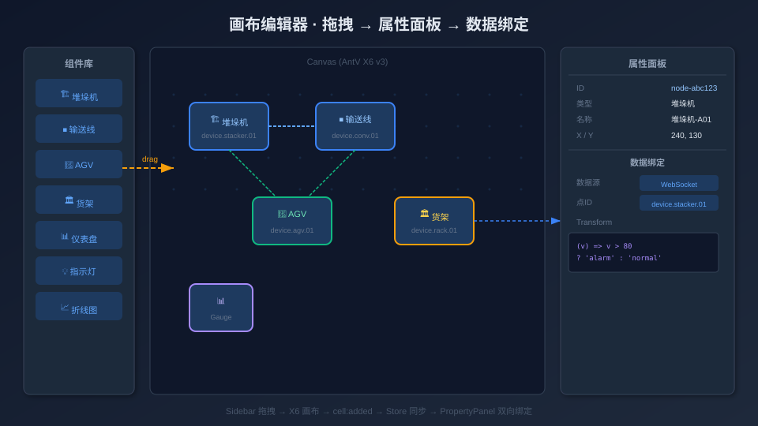

# 从零搭建仓储自动化 SCADA 组态平台（二）：基于 AntV X6 v3 的画布编辑器核心实现

> 本系列第 2 篇，深入拆解画布编辑器的核心实现：X6 图引擎集成、自定义 Vue 节点注册、配置驱动的节点工厂、画布与 Store 的双向同步防循环机制，以及属性面板的数据绑定设计。



## 一、画布引擎：为什么是 AntV X6 v3

画布编辑器是整个平台的基座——所有设备节点的拖拽、摆放、连线、数据绑定、动画播放都发生在 X6 的 Graph 实例上。选 X6 v3 的核心理由有三个：

**原生 Vue 3 支持**。通过 `@antv/x6-vue-shape`，可以直接把 Vue 组件注册为 X6 节点。节点内部的响应式状态、事件处理、生命周期完全走 Vue 的体系，不需要在 X6 的 `markup`/`attrs` 声明式语法和 Vue 的模板语法之间做痛苦的适配。

**插件生态**。Selection（框选/多选）、Dnd（拖拽放置）、Clipboard（复制粘贴）、Keyboard（快捷键）、Snapline（对齐线）等编辑器必备能力都是官方插件，开箱即用。

**渲染性能**。X6 v3 的渲染器基于 `requestAnimationFrame` 调度，支持虚拟渲染（只渲染视口内的节点），对于大型 SCADA 画面（数百个节点）不会卡顿。

### 画布初始化

`X6Canvas.vue` 是画布的入口组件。`onMounted` 中创建 Graph 实例并初始化插件：

```typescript
// X6Canvas.vue - onMounted
const graph = new Graph({
  container: containerRef.value,
  grid: { visible: true, size: 10, type: 'dot' },
  snapline: { enabled: true },
  selecting: { enabled: true, rubberband: true, multiple: true },
  connecting: {
    router: 'manhattan',
    connector: { name: 'rounded' },
    createEdge: () => graph.value!.createEdge({ shape: 'edge' }),
  },
  keyboard: { enabled: true },
  virtual: { enabled: true, margin: 150 },  // 虚拟渲染
})

// 初始化 Vue Shape 渲染容器
const teleportContainer = new TeleportContainer({ graph })

// 通过 emit 把 graph/dnd 实例传给父组件
emit('ready', { graph, dnd: new Dnd({ target: graph, /* ... */ }) })
```

一个值得注意的细节：组件内部同时维护了一个普通变量 `let graph` 和一个 `ref<Graph> graphRef`。普通变量用于所有闭包和事件回调（避免响应式代理的开销），ref 则通过 `defineExpose` 暴露给父组件。这是 X6 与 Vue 协作时的一个实用模式——X6 内部大量使用闭包和回调，如果每次都通过 `graphRef.value` 访问，会引入不必要的响应式追踪。

## 二、自定义节点注册：数据驱动取代散落的注册代码

项目有 13 种节点类型（8 类 WCS 设备 + 3 类 IoT + 基础图形），每种都是一个独立的 Vue 组件。如何把它们统一注册到 X6？

### 集中式注册表

`nodes/registry.ts` 用一个数组 + 循环注册取代了散落在各处的 `graph.registerNode` 调用：

```typescript
// nodes/registry.ts
import StackerNode from './StackerNode.vue'
import ConveyorNode from './ConveyorNode.vue'
// ... 其他 11 个组件

const nodeRegistry = [
  { shape: 'stacker-node',   component: StackerNode },
  { shape: 'conveyor-node',  component: ConveyorNode },
  { shape: 'agv-node',       component: AgvNode },
  { shape: 'shuttle-node',   component: ShuttleNode },
  { shape: 'sorter-node',    component: SorterNode },
  { shape: 'elevator-node',  component: ElevatorNode },
  { shape: 'robot-node',     component: RobotNode },
  { shape: 'rack-node',      component: RackNode },
  { shape: 'gauge-node',     component: GaugeNode },
  { shape: 'chart-node',     component: ChartNode },
  { shape: 'indicator-node', component: IndicatorNode },
  { shape: 'custom-card',    component: CustomCard },
]

let registered = false
export function registerAllNode() {
  if (registered) return
  register({ shape: 'stacker-node',   component: StackerNode })
  register({ shape: 'conveyor-node',  component: ConveyorNode })
  // ...
  registered = true
}

// 模块导入时自动注册
registerAllNode()
```

关键设计：**幂等注册**（`registered` 标志位防止重复）和**副作用导入**（import 即注册，不需要显式调用）。`main.ts` 和 `RunView.vue` 只需 `import '@/components/nodes/registry'` 即可。

## 三、配置驱动的节点工厂

### 从 if-else 地狱到模板数组

早期版本的 `Sidebar.vue` 里有一个 200 行的 `handleDragStart` 函数，用 if-else 为每种节点类型构建配置。重构后，我们抽取了一个 `NodeTemplate` 接口和一个声明式的模板数组：

```typescript
// nodes/nodeTemplates.ts
interface NodeTemplate {
  type: string              // X6 shape 名
  label: string             // 侧栏显示名
  icon: string              // 图标 emoji
  width?: number
  height?: number
  pointIdTemplate?: string  // 数据点 ID 模板前缀
  data?: Record<string, any> | (() => Record<string, any>)
  buildData?: () => Record<string, any>  // 复杂构建（优先于 data）
  transform?: (value: number, data: any) => Record<string, any>
  transformSource?: string  // transform 的序列化形式
}

const templates: NodeTemplate[] = [
  {
    type: 'stacker-node',
    label: '堆垛机',
    icon: '🏗️',
    width: 120, height: 80,
    pointIdTemplate: 'device.stacker',
    data: { name: '堆垛机-01', status: 'idle', isMoving: false, progress: 0 },
    transform: (v, d) => ({
      status: v > 80 ? 'running' : 'idle',
      isMoving: v > 0,
      progress: v / 100,
    }),
    transformSource: `(v,d)=>({status:v>80?'running':'idle',isMoving:v>0,progress:v/100})`,
  },
  {
    type: 'rack-node',
    label: '货架',
    icon: '🏛️',
    width: 200, height: 150,
    pointIdTemplate: 'device.rack',
    buildData: () => ({
      name: '货架-A01',
      rows: 4, cols: 6,
      grid: Array.from({ length: 4 }, () =>
        Array.from({ length: 6 }, () => Math.random() > 0.3 ? 1 : 0)
      ),
    }),
  },
  // ... 其他 11 种
]
```

### 统一的构建函数

`buildNodeConfig()` 消费一个 `NodeTemplate`，产出可以直接交给 `graph.createNode()` 的配置：

```typescript
export function buildNodeConfig(tpl: NodeTemplate): Partial<Node.Properties> {
  const generator = PointIdGenerator.getInstance()
  const pointId = tpl.pointIdTemplate
    ? generator.generate(tpl.pointIdTemplate)
    : ''

  // 数据构建：buildData > data（函数调用 / 对象深拷贝）
  let nodeData: Record<string, any> = {}
  if (tpl.buildData) {
    nodeData = tpl.buildData()
  } else if (tpl.data) {
    nodeData = typeof tpl.data === 'function'
      ? tpl.data()
      : structuredClone(tpl.data)
  }

  // 注入数据绑定
  if (pointId) {
    nodeData.binding = {
      pointId,
      sourceType: 'websocket',
      transform: tpl.transform,
      transformSource: tpl.transformSource,
    }
  }

  return {
    shape: tpl.type,
    width: tpl.width ?? 120,
    height: tpl.height ?? 80,
    data: nodeData,
  }
}
```

### Transform 的序列化难题

这是节点工厂里最精妙的设计。每个设备节点的 `transform` 函数把原始数据值映射为业务状态（比如堆垛机的 `status`/`isMoving`/`progress`）。但函数不能 JSON 序列化——项目保存/加载时怎么办？

解决方案：**双字段策略**。每个模板同时保存 `transform`（运行时函数）和 `transformSource`（函数的 `toString()` 结果）。保存时序列化 `transformSource`，加载时用 `new Function('return ' + source)()` 重新编译。

```typescript
// 序列化
const saved = JSON.stringify(graphData)  // transformSource 是字符串，自动序列化

// 反序列化
loadedNode.data.binding.transform = new Function(
  'return ' + loadedNode.data.binding.transformSource
)()
```

一个关键约束：`transform` 函数必须是**闭包无关的**——不能引用外部变量。因为 `toString()` 产出的源码必须在任何作用域下都能独立编译执行。看堆垛机的 transform：

```typescript
// ✅ 正确：所有常量内联
transform: (v, d) => ({
  status: v > 80 ? 'running' : 'idle',
  isMoving: v > 0,
  progress: v / 100,
})

// ❌ 错误：引用了外部阈值
const THRESHOLD = 80
transform: (v, d) => ({
  status: v > THRESHOLD ? 'running' : 'idle',  // THRESHOLD 序列化后丢失
})
```

## 四、画布与 Store 的双向同步

这是整个编辑器最棘手的部分。X6 Graph 和 Pinia Store 都持有画布数据，任何一方的修改都要同步到另一方。但如果处理不好，就会产生无限循环：Store 更新 → watcher 触发 → 更新 Graph → 事件触发 → 更新 Store → ...

### 五重防循环标志位

`useGraphSync.ts` 用 5 个布尔标志位精确控制同步方向：

```typescript
let isUpdatingFromStore = false   // Store → Graph 同步中
let isSyncingPosition = false     // 位置同步中（拖拽/属性面板）
let isSyncingSize = false         // 尺寸同步中
let isResizing = false            // 用户正在拖拽缩放手柄
let isSyncSuppressed = false      // 全局同步抑制（批量操作时）
```

### 画布 → Store（事件绑定）

```typescript
function bindGraphEvents() {
  graph.on('node:moved', ({ node }) => {
    if (isUpdatingFromStore || isSyncSuppressed) return
    const pos = node.getPosition()
    editorStore.updateNode(node.id, { x: pos.x, y: pos.y })
  })

  graph.on('cell:change:data', ({ cell }) => {
    if (isSyncingPosition || isResizing || isSyncSuppressed) return
    // 序列化节点数据写入 Store
    syncNodeDataToStore(cell)
  })

  graph.on('selection:changed', ({ selected }) => {
    editorStore.setSelected(selected[0]?.id ?? null)
  })
}
```

### Store → 画布（Watcher）

关键优化：**位置/尺寸 watcher 与全量数据 watcher 分离**。

```typescript
// 快速路径：只监听 id/x/y/width/height，拖拽时不触发全量重载
watch(
  () => editorStore.graphData.nodes.map(n =>
    ({ id: n.id, x: n.x, y: n.y, width: n.width, height: n.height })
  ),
  (newVal) => {
    if (isSyncSuppressed) return
    isUpdatingFromStore = true
    for (const item of newVal) {
      const cell = graph.getCellById(item.id)
      if (cell?.isNode()) {
        cell.setPosition(item.x, item.y)
        cell.setSize(item.width, item.height)
      }
    }
    nextTick(() => { isUpdatingFromStore = false })
  }
)

// 慢速路径：全量数据对比，仅在结构性变化时触发重载
watch(
  () => editorStore.graphData,
  (newData, oldData) => {
    if (isSameGraphData(newData, oldData)) return
    reloadGraph(newData)
  },
  { deep: false }  // shallowRef 不需要 deep
)
```

`isSameGraphData()` 通过排序后 JSON 序列化对比，消除因 cell 顺序不同导致的误判。这个分离设计是性能的关键——拖拽节点时只走快速路径（更新坐标），不会触发全量重载（重建所有节点）。

### 缩放批处理

拖拽缩放手柄时，X6 会在每一帧触发 `node:resize`（进行中）和最终的 `node:resized`（结束）。如果在 `node:resize` 里就同步 Store，Store watcher 又会调用 `setSize` 打断拖拽。解决方案：

```typescript
graph.on('node:resize', () => {
  isResizing = true  // 抑制 cell:change:data 同步
})

graph.on('node:resized', ({ node }) => {
  isResizing = false
  const size = node.getSize()
  editorStore.updateNode(node.id, { width: size.width, height: size.height })
})
```

## 五、属性面板：数据绑定配置

`PropertyPanel.vue` 显示选中节点的所有属性，其中「数据绑定」标签页是最核心的功能：

```
┌─────────────────────────────────┐
│  节点属性                        │
│  ┌─────────────────────────────┐│
│  │ ID: node_1785634086376      ││
│  │ 名称: 堆垛机-01             ││
│  │ X: 420   Y: 520            ││
│  ├─────────────────────────────┤│
│  │ 数据绑定 ▼                  ││
│  │ 数据源: [websocket ▼]       ││
│  │ 点ID:   device.stacker_001  ││
│  │ Transform:                  ││
│  │ ┌─────────────────────────┐ ││
│  │ │ (v,d) => ({             │ ││
│  │ │   status: v>80?'run':…  │ ││
│  │ │ })                      │ ││
│  │ └─────────────────────────┘ ││
│  └─────────────────────────────┘│
└─────────────────────────────────┘
```

属性面板的数据来源有一个**兜底策略**：优先从 `editorStore.selectedElement` 读取（Store 是单一数据源），但如果 Store 中的 `binding` 数据不完整，会直接从 X6 节点实例的 `getData()` 读取，确保信息不丢失。

坐标同步则采用独立管理策略：通过 `posX`/`posY` 两个 ref + `requestAnimationFrame` 轮询从 X6 节点实例直接读取精确坐标，避免 deep watcher 导致的响应式循环。

## 六、右键菜单与显示模式

画布支持全局显示模式切换（完整/图标/精简），通过 `editorStore.displayMode` 控制。每个节点可以单独覆盖全局设置——右键菜单提供「跟随全局 / 完整 / 图标」三个选项。

设置节点级覆盖时有一个 X6 的坑：`node.setData({ displayMode: null })` 中的 `null` 不能换成 `undefined`，因为 X6 的浅合并策略不会删除 `undefined` 值的 key，但会用 `null` 覆盖。这个细节在调试时花了不少时间。

菜单通过 `<Teleport to="body">` 渲染，避免被画布容器的 `overflow: hidden` 裁切。

## 七、小结

画布编辑器的核心挑战可以归纳为三个：

1. **X6 与 Vue 的协作模式**：普通变量 + ref 双轨制，闭包用普通变量，模板用 ref。
2. **双向同步的防循环**：5 个标志位 + 快速/慢速路径分离 + 缩放批处理。
3. **Transform 的序列化**：闭包无关函数 + `toString()` + `new Function` 重编译。

---

**上一篇**：[（一）项目总览与架构设计](./01-项目总览与架构设计.md)
**下一篇**：[（三）多协议数据接入体系：7 种工业协议如何统一抽象](./03-多协议数据接入体系.md)
