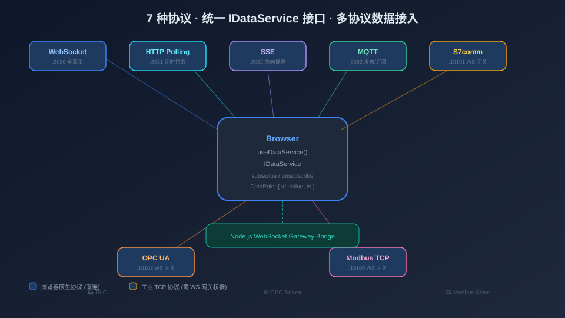

# 从零搭建仓储自动化 SCADA 组态平台（三）：多协议数据接入体系

> 本系列第 3 篇，聚焦数据接入层：如何用一套 `IDataService` 接口统一 7 种异构协议，工业网关的 WebSocket 桥接设计，模拟数据服务的特征化生成，以及数据绑定的 Transform 机制。



## 一、问题：7 种协议，一套接口

仓储自动化场景下，数据来源极其异构：WebSocket 推送传感器数据、HTTP 轮询 REST 接口、SSE 接收服务端事件、MQTT 订阅 IoT 设备主题——这 4 种是浏览器原生支持的。但工业现场还有 S7comm（西门子 PLC）、OPC UA（多厂商标准）、Modbus TCP（通用仪表/PLC）——这 3 种是原生 TCP 协议，浏览器根本无法直连。

7 种协议，连接方式、消息格式、订阅模型各不相同。但站在节点组件的角度，它们的需求很简单：**给我一个数据点的实时值**。

这就是 `IDataService` 接口的设计动机：

```typescript
// services/DataService.ts
export interface IDataService {
  /** 订阅一个数据点，回调接收实时更新 */
  subscribe(pointId: string, callback: (point: DataPoint) => void): void

  /** 取消订阅 */
  unsubscribe(pointId: string): void

  /** 当前是否已连接 */
  isConnected(): boolean

  /** 断开连接，释放资源 */
  disconnect(): void
}

export interface DataPoint {
  id: string
  value: number | string
  timestamp: number
  quality?: 'good' | 'bad' | 'uncertain'
}
```

4 个方法，覆盖所有协议的公共操作。无论底层是 WebSocket 长连接、HTTP 定时拉取、MQTT 主题订阅还是 S7 变量读取，节点组件只需要调用 `subscribe(pointId, callback)` 就能拿到统一的 `DataPoint` 流。

## 二、7 种实现

### 浏览器原生协议（4 种直连）

**WebSocketService**：最直接的实现。`subscribe` 时发送 `{ action: 'subscribe', topic: pointId }`，监听消息并分发给回调。内置自动重连和心跳。

**HttpPollingService**：定时 `fetch` 拉取。`subscribe` 启动一个 `setInterval`（默认 1000ms），每次请求 `GET /api/data?pointId=xxx`，把响应包装为 `DataPoint`。`unsubscribe` 清除定时器。

**SseService**：利用浏览器原生 `EventSource`。`subscribe` 时创建 EventSource 连接，`onmessage` 解析数据。SSE 的优势是自动重连和标准 HTTP 语义。

**MqttService**：基于 `mqtt.js` over WebSocket。`subscribe` 时调用 `client.subscribe(topic)`，`message` 事件分发。MQTT 的通配符主题（`device/+/status`）在这里天然支持。

### 工业协议（3 种网关桥接）

**S7Service / OpcService / ModbusService** 共享同一个抽象基类 `GatewayService`——这是整个数据接入层最精妙的设计。

```typescript
// services/GatewayService.ts
export abstract class GatewayService implements IDataService {
  protected ws: WebSocket | null = null
  protected url: string
  protected config: Record<string, any> = {}
  protected callbacks = new Map<string, Set<(point: DataPoint) => void>>()
  protected abstract tag: string  // 日志标签

  subscribe(pointId: string, callback: (point: DataPoint) => void) {
    if (!this.callbacks.has(pointId)) {
      this.callbacks.set(pointId, new Set())
    }
    this.callbacks.get(pointId)!.add(callback)

    // 首次订阅时建立 WebSocket 连接
    if (!this.ws) this.connect()
    // 发送订阅消息
    else if (this.ws?.readyState === WebSocket.OPEN) {
      this.ws.send(JSON.stringify({ action: 'subscribe', topic: pointId }))
    }
  }

  private connect() {
    this.ws = new WebSocket(this.url)

    this.ws.onopen = () => {
      // 发送设备配置
      this.ws!.send(JSON.stringify({ action: 'configure', config: this.config }))
      // 重新订阅所有已注册的点（重连后恢复）
      for (const pointId of this.callbacks.keys()) {
        this.ws!.send(JSON.stringify({ action: 'subscribe', topic: pointId }))
      }
    }

    this.ws.onmessage = (event) => {
      const msg = JSON.parse(event.data)
      if (msg.type === 'status') {
        // 设备连接状态反馈
        this.handleStatus(msg)
      } else {
        // 数据点更新 → 分发给所有回调
        const cbs = this.callbacks.get(msg.topic)
        cbs?.forEach(cb => cb({
          id: msg.topic,
          value: msg.value,
          timestamp: msg.timestamp ?? Date.now(),
          quality: msg.quality ?? 'good',
        }))
      }
    }

    this.ws.onclose = () => {
      // 3 秒后自动重连
      setTimeout(() => this.connect(), 3000)
    }
  }

  unsubscribe(pointId: string) {
    this.callbacks.delete(pointId)
    this.ws?.send(JSON.stringify({ action: 'unsubscribe', topic: pointId }))
  }

  disconnect() {
    this.ws?.close()
    this.ws = null
    this.callbacks.clear()
  }

  isConnected() { return this.ws?.readyState === WebSocket.OPEN }
}
```

子类只需要提供 `tag` 和协议特有的配置结构，95% 的逻辑由基类处理。这就是**模板方法模式**的威力：

```typescript
// services/S7Service.ts
export class S7Service extends GatewayService {
  protected tag = 'S7'
  // 只需覆盖 connect 中的 configure 消息格式即可
}
```

### WebSocket 网关协议

三种工业网关（Node.js 进程）与前端之间定义了一个简洁的 JSON 协议：

```
前端 → 网关:
  { action: 'configure', config: { host, port, rack, slot, ... } }
  { action: 'subscribe', topic: 'DB1,REAL0' }
  { action: 'unsubscribe', topic: 'DB1,REAL0' }

网关 → 前端:
  { type: 'status', connected: true, message: 'S7 connected' }
  { topic: 'DB1,REAL0', value: 3.14, timestamp: 1720000000000, quality: 'good' }
```

网关进程内部用原生 TCP 协议连接 PLC（nodes7 / node-opcua / modbus-serial），把读写结果翻译为上述 JSON 格式推送到 WebSocket。

## 三、服务工厂与缓存

`useDataService` 组合式函数是连接节点和数据服务的桥梁。它维护了一个服务实例缓存，避免对同一个端点建立多条连接：

```typescript
// composables/useDataService.ts
const serviceCache = new Map<string, IDataService>()

function getDataService(
  sourceType: string,
  sourceUrl: string,
  sourceConfig?: Record<string, any>
): IDataService {
  const key = `${sourceType}:${sourceUrl}`

  if (serviceCache.has(key)) return serviceCache.get(key)!

  let service: IDataService
  switch (sourceType) {
    case 'websocket': service = new WebSocketService(sourceUrl); break
    case 'http':      service = new HttpPollingService(sourceUrl); break
    case 'sse':       service = new SseService(sourceUrl); break
    case 'mqtt':      service = new MqttService(sourceUrl); break
    case 's7':        service = new S7Service(sourceUrl, sourceConfig); break
    case 'opc':       service = new OpcService(sourceUrl, sourceConfig); break
    case 'modbus':    service = new ModbusService(sourceUrl, sourceConfig); break
    default:          service = new MockDataService(); break
  }

  serviceCache.set(key, service)
  return service
}
```

当 10 个节点都订阅同一个 WebSocket 端点的不同数据点时，只有 1 个 WebSocket 连接、1 个 `WebSocketService` 实例。`subscribe` 只是注册回调，`unsubscribe` 只是移除回调——连接始终复用。

### 绑定与解绑

```typescript
function bindNodeData(node: Cell, binding: DataBindingConfig) {
  const service = getDataService(binding.sourceType, binding.sourceUrl, binding.sourceConfig)
  service.subscribe(binding.pointId, (point) => {
    // 应用 transform
    let value = point.value
    if (binding.transform) {
      const nodeData = node.getData()
      value = binding.transform(point.value, nodeData)
    }
    // 写入节点数据
    node.setData({
      value: point.value,
      _timestamp: point.timestamp,
      _quality: point.quality,
      ...value,  // transform 返回的业务字段展开
    }, { silent: true })  // silent 避免触发 cell:change 循环
  })

  // 记录映射关系，用于清理
  nodeServiceKeys.set(node.id, `${binding.sourceType}:${binding.sourceUrl}`)
  nodeDataSubscriptions.set(node.id, binding.pointId)
}

function unbindNodeData(nodeId: string) {
  const key = nodeServiceKeys.get(nodeId)
  const pointId = nodeDataSubscriptions.get(nodeId)
  if (key && pointId) {
    serviceCache.get(key)?.unsubscribe(pointId)
    nodeServiceKeys.delete(nodeId)
    nodeDataSubscriptions.delete(nodeId)
  }
}
```

`unbindAllNodes()` 取消所有订阅但保留连接（用于画布重载），`dispose()` 则断开所有连接、清空缓存（用于组件卸载）。

## 四、模拟数据服务：特征化生成

开发阶段不可能每次都接真实 PLC。`mock/` 目录下的 7 类模拟服务为每种协议生成了具有**数据特征**的模拟值：

| 协议 | 模拟地址 | 数据特征 | 视觉表现 |
|------|----------|----------|----------|
| WebSocket | `ws://localhost:8080/ws` | 正弦波 20~80 | 平滑周期波动 |
| HTTP 轮询 | `http://localhost:8081/api/data` | 随机阶梯 | 突变保持 |
| SSE | `http://localhost:8082/sse` | 锯齿斜升 | 线性增长后归零 |
| MQTT | `ws://localhost:8083` | 离散档位 | 跳变 |
| S7 | `ws://localhost:8084/s7` | 设定值跟踪 | 缓慢趋近目标 |
| OPC UA | `ws://localhost:8085/opc` | 量化阶梯 | 阶梯式变化 |
| Modbus | `ws://localhost:8086/modbus` | 三角波 | 对称升降 |

这些特征数据不是简单的随机数——每种协议的数据模式都模拟了真实工业场景中的典型信号。这样在演示时，仪表盘的正弦波、折线图的锯齿、输送线的阶梯跳变，看起来就像真实设备在运行。

模拟服务通过 Vite 插件自动启动：

```typescript
// vite.config.ts
import { startMockServers } from './mock/server.ts'

export default defineConfig({
  plugins: [
    vue(),
    {
      name: 'mock-data-servers',
      configureServer() { startMockServers() },
    },
  ],
})
```

`npm run dev` 一条命令，7 个模拟服务随开发服务器一起启动，零额外操作。

## 五、数据绑定的 Transform 机制

节点拿到原始数据值后，通常不能直接使用——`holding:100` 的 Modbus 寄存器值是 0~100 的整数，但堆垛机节点需要的是 `{ status: 'running', isMoving: true, progress: 0.75 }` 这样的业务状态。

**Transform 函数**就是这个映射层：

```typescript
// 堆垛机的 transform
(v, d) => ({
  status: v > 80 ? 'running' : 'idle',
  isMoving: v > 0,
  progress: v / 100,
})

// 货架的 transform（更复杂：映射到货位占用矩阵）
(v, d) => {
  const grid = d.grid?.map(row =>
    row.map(cell => (Math.random() > 0.5 ? 1 : 0))
  ) ?? d.grid
  return { grid }
}
```

Transform 的输入是 `(原始值, 当前节点数据)`，输出是一个对象，其字段会展开合并到节点的 `data` 中。节点 Vue 组件通过读取这些字段来更新视觉表现。

### Transform 的持久化

如第 2 篇所述，函数不能 JSON 序列化。项目采用 `transform`（运行时）+ `transformSource`（字符串）双字段策略。保存项目时序列化 `transformSource`，加载时用 `new Function` 重编译。这要求 transform 函数**闭包无关**——所有常量必须内联。

## 六、数据源管理 UI

`DataSourceDialog.vue` 提供了一个统一的管理界面，用户可以：

1. **创建数据源实例**：选择协议类型、填写连接参数（URL / 主机 / 端口 / 机架 / 插槽等）
2. **切换演示/真实模式**：一键在模拟服务和真实网关之间切换
3. **实时连通性探测**：`GatewayMonitorService` 定时检测每个数据源的连接状态、建连耗时、数据点实时值
4. **错误告警**：连接失败、数据质量异常时在监控面板高亮显示

数据源实例存储在 `dataSourceStore` 中，节点绑定通过 `sourceId` 引用实例，而不是内嵌连接参数。这意味着修改一个数据源的 URL，所有引用它的节点自动生效。

## 七、架构全景

```
节点组件
  │
  ├── binding.sourceType = 'websocket'  →  WebSocketService 直连
  ├── binding.sourceType = 'mqtt'       →  MqttService 直连
  ├── binding.sourceType = 's7'         →  S7Service → WS → Node网关 → TCP → PLC
  └── binding.sourceType = 'modbus'     →  ModbusService → WS → Node网关 → TCP → PLC
          │
          ▼
    IDataService.subscribe(pointId, callback)
          │
          ▼
    DataPoint { id, value, timestamp, quality }
          │
          ▼
    transform(value, nodeData) → 业务状态字段
          │
          ▼
    node.setData({ ...业务字段 }) → Vue 组件响应式更新
```

无论数据来自哪种协议，最终都走同一条路径：`subscribe → DataPoint → transform → setData → Vue 渲染`。这就是统一抽象的价值——新增一种协议只需要实现 `IDataService` 接口，节点组件完全不用改。

---

**上一篇**：[（二）基于 AntV X6 v3 的画布编辑器核心实现](./02-画布编辑器核心实现.md)
**下一篇**：[（四）路线编辑器与浮动窗口：Teleport 的巧妙运用](./04-路线编辑器与浮动窗口.md)
