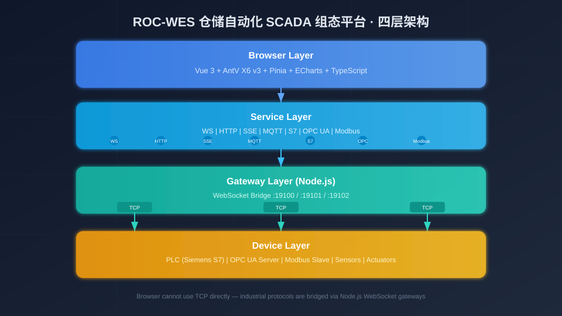

# 从零搭建仓储自动化 SCADA 组态平台（一）：项目总览与架构设计

> 本系列共 5 篇，基于 Vue 3 + AntV X6 v3 + Tauri 2 的开源项目 roc-wes，完整拆解一个仓储自动化 SCADA 组态平台从画布编辑器、多协议数据接入、路线编辑到运行态动画的全链路实现。这是第 1 篇，从项目全貌和架构设计讲起。



## 一、我们要解决什么问题

仓储自动化（WCS）场景下，工程师面临一个反复出现的痛点：每接一个新项目，都要从头写一套设备监控画面。堆垛机、输送线、AGV、穿梭车、分拣机……设备种类大同小异，但每个客户的布局、数据点位、告警规则都不一样。市面上的 SCADA 软件要么太重（WinCC、组态王），要么不支持 Web，要么和 WCS 业务脱节。

roc-wes 的目标是：**一个桌面端的、面向仓储设备的可视化组态编辑器**。工程师拖拽设备图标、配置数据绑定、编排运行路线，然后一键切换到 SCADA 运行态，实时看到设备状态刷新。整个应用是 Tauri 2 桌面程序：前端是 Vue 3 Web 应用，外壳与设备网关由 Rust 实现——工业协议直接在 Rust 侧用原生 TCP 连接 PLC，画面数据经 IPC 送入前端，无需部署任何服务器。

项目覆盖三大核心环节：

**仿真演示**：内置模拟数据服务（WebSocket / HTTP 轮询 / SSE / MQTT 四类，随开发环境自动启动）；三种工业协议（S7 / OPC UA / Modbus）的演示模式由 Rust 侧的 DemoAdapter 提供。无需真实 PLC，就能完整体验数据绑定和画面联动。

**实时监控**：统一管理 7 种协议的数据源连接，支持演示/真实双模式一键切换。节点通过 `binding` 配置关联数据源点位，支持 transform 函数将原始值映射为业务状态。边沿触发告警采用 PLC 语义（上升沿/下降沿），避免持续报警。

**运行执行**：编辑器中设计的画面可通过「运行」按钮进入 SCADA 运行态，全屏展示设备画面，数据服务持续订阅，节点实时刷新。适用于现场看板式部署或演示汇报。

## 二、组件库：8 类 WCS 设备 + IoT 监控

编辑器内置了仓储自动化最常见的设备组件：

| 类别 | 组件 | 说明 |
|------|------|------|
| WCS 设备 | 堆垛机 Stacker | 带行走进度、载货台状态 |
| | 输送线 Conveyor | 带运行方向动画 |
| | AGV | 带位置移动动画 |
| | 穿梭车 Shuttle | 带轨道行走动画 |
| | 分拣机 Sorter | 带多出口状态 |
| | 提升机 Elevator | 带升降进度 |
| | 机械臂 Robot | 带关节角度 |
| | 货架 Rack | 带货位占用热力图 |
| IoT 监控 | 仪表盘 Gauge | ECharts 驱动 |
| | 实时折线图 Chart | ECharts 驱动 |
| | 指示灯 Indicator | 三色状态灯 |
| 基础图形 | 矩形 / 圆形 / 自定义卡片 | 通用标注 |

每个设备节点预置了数据绑定点位模板——拖入画布即自动关联数据源，开箱即用。

## 三、技术选型

| 类别 | 技术 | 版本 | 选型理由 |
|------|------|------|----------|
| 框架 | Vue 3 | ^3.5 | Composition API，响应式精细控制 |
| 构建 | Vite | ^8.1 | 极速 HMR，插件生态 |
| 图引擎 | AntV X6 | ^3.1 | 原生 Vue 3 支持，自定义节点能力强 |
| 状态管理 | Pinia | ^3.0 | setup store 风格，与 Composition API 一致 |
| 图表 | ECharts | ^6.1 | 仪表盘/折线图渲染 |
| 语言 | TypeScript | ~6.0 | 全量类型覆盖 |
| MQTT | mqtt.js | ^5.15 | 浏览器端 MQTT over WebSocket |
| 桌面壳 | Tauri | ^2 | 体积小、Rust 后端、原生系统集成 |
| 设备网关 | Rust（tokio / tokio-modbus） | — | 原生 TCP 协议栈，同进程内运行 |

为什么选 AntV X6 而不是 GoJS / JointJS / 自研 Canvas？X6 v3 对 Vue 3 的支持是一等公民——通过 `@antv/x6-vue-shape` 可以直接把 Vue 组件注册为 X6 节点，节点内部的状态、事件、生命周期完全走 Vue 的响应式。这对于我们这种「节点 = 一个完整 Vue 组件」的场景，开发体验远好于 GoJS 那种纯命令式 API。

桌面壳为什么选 Tauri 而不是 Electron？SCADA 组态画面本身已经足够吃内存，Electron 自带的 Chromium + Node.js 运行时会再叠加一层数百 MB 的开销；而 Tauri 复用系统 WebView，安装包只有十几 MB。更关键的是：Tauri 的后端是 Rust，工业协议（Modbus TCP 等）可以直接用 tokio 异步 TCP 实现为同进程内的网关 crate，前端经 IPC 订阅数据——不再需要独立的网关进程和本地端口。当前 Modbus 适配器已落地，S7 / OPC UA 适配器预留了扩展点。

## 四、整体架构

项目采用清晰的四层架构：

```
┌─────────────────────────────────────────────────────────────┐
│  视图层（View）                                              │
│  X6Canvas · Sidebar · PropertyPanel · RouteEditorDialog     │
│  RunView · MainLayout · BottomPanel · RouteFloatWindow      │
├─────────────────────────────────────────────────────────────┤
│  状态层（State）                                              │
│  editorStore（画布/选中/历史/显示模式）                         │
│  routeStore（路线定义/航点/分段）                               │
│  dataSourceStore（数据源实例配置）                              │
│  themeStore（主题切换）                                        │
├─────────────────────────────────────────────────────────────┤
│  组合逻辑层（Composable）                                     │
│  useGraphSync（画布↔Store 双向同步）                           │
│  useDataService（数据订阅生命周期）                             │
│  useNodeEvents（边沿触发事件）                                  │
│  useNodeData / useNodeStatus / useDisplayMode                │
├─────────────────────────────────────────────────────────────┤
│  服务层（Service）                                            │
│  IDataService 接口 → 7 种协议实现                              │
│  AnimationService（单 rAF 循环动画调度）                       │
│  RouteService（路线渲染/高亮）                                 │
│  GatewayMonitorService（网关连通探针）                         │
└─────────────────────────────────────────────────────────────┘
```

**视图层**负责渲染和用户交互，所有组件都是 Vue 3 `<script setup>` 风格。**状态层**用 Pinia setup store 管理，`editorStore` 用 `shallowRef` 存储画布序列化数据（避免深层代理的性能陷阱），`routeStore` 独立管理路线实体。**组合逻辑层**是可复用逻辑的核心——`useGraphSync` 用 5 个防循环标志位解决了画布与 Store 双向同步的经典难题，`useDataService` 统一了编辑态和运行态的数据订阅生命周期。**服务层**定义了 `IDataService` 接口，各协议各自实现；桌面运行时工业协议统一走 `IpcGatewayService`（Tauri IPC 网关客户端），浏览器环境保留的 WS 桥接实现仅作兜底。

## 五、数据接入架构

这是整个项目最有特色的部分——7 种协议统一接入。

```
┌──────────────────────────────────────────────────────────┐
│  Tauri 应用（单进程）                                       │
│                                                          │
│  ┌───────────────────────────────────────────────────┐ │
│  │  前端（WebView / Vue 3）                              │ │
│  │  节点组件 ← useDataService ← IDataService 实现      │ │
│  │              │ WebSocket/HTTP/SSE/MQTT 直连         │ │
│  │              │ IpcGatewayService（工业协议）         │ │
│  └─────────────┼───────────────────────────────────┘ │
│              │ Tauri IPC（invoke 命令 + 事件推送）       │
│  ┌─────────────▼───────────────────────────────────┐ │
│  │  Rust 网关（crates/）                               │ │
│  │  gateway-core（领域模型） · gateway-engine（会话）   │ │
│  │  gateway-modbus（真实 Modbus） · gateway-demo（演示）│ │
│  └─────────────┬───────────────────────────────────┘ │
└─────────────┼───────────────────────────────────────────┘
              │ 原生 TCP
              ▼
   ┌─────────────────────┐        ┌───────────────────────┐
   │  真实 PLC / 网关     │        │  内置模拟服务 (mock/)  │
   │  Modbus / S7 / OPC  │        │  端口 8080-8083，仅开发 │
   └─────────────────────┘        └───────────────────────┘
```

前 4 种协议（WebSocket / HTTP / SSE / MQTT）是浏览器原生支持的，前端 Service 直连服务端即可。后 3 种工业 TCP 协议（S7comm / OPC UA / Modbus TCP）浏览器无法直连——桌面运行时由 `IpcGatewayService` 通过 Tauri IPC（invoke 命令 + 事件推送）接入同进程内的 Rust 网关，网关用 tokio 原生 TCP 连接真实 PLC 或演示适配器。浏览器开发环境保留旧的 WS 桥接实现作兜底；开发环境下 `mock/` 仅提供前 4 类协议的模拟服务（8080-8083），工业协议的演示模式由 Rust DemoAdapter 接管。

无论数据来自哪种协议，在编辑器内部都归一为统一的 `DataPoint` 模型：

```typescript
interface DataPoint {
  id: string                 // 数据点标识
  value: number | string     // 数值
  timestamp: number          // 毫秒时间戳
  quality?: 'good' | 'bad' | 'uncertain'  // 数据质量
}
```

节点通过属性面板的「数据绑定」标签页配置 `pointId` + `sourceType` + `transform` 函数。绑定后，数据点更新自动写入 `node.data.value`，并驱动节点事件评估（上升沿/下降沿触发告警）。

## 六、项目结构速览

```
roc-wes/
├── src/
│   ├── components/nodes/       # 8 类设备 + 3 类 IoT + 基础图形
│   ├── components/             # 画布、侧栏、属性面板、工具栏、数据源对话框
│   ├── composables/            # useGraphSync / useDataService / useNodeEvents...
│   ├── services/               # IDataService + 各协议 + IPC 网关 + 动画 + 路由 + 事件
│   ├── platform/               # isTauri 运行时探测 / IPC 设备配置转换
│   ├── stores/                 # editor / route / dataSource / theme
│   ├── views/RunView.vue       # SCADA 运行态
│   └── layouts/MainLayout.vue  # 根布局（8 个子组件编排）
├── src-tauri/                  # Tauri 2 桌面壳 + Rust 网关 workspace
│   └── crates/                 # gateway-core / engine / modbus / demo
├── mock/                       # 内置模拟服务（WS/HTTP/SSE/MQTT，仅开发环境）
└── docs/数据源手册/             # 各协议 × 用户使用 + 开发手册
```

## 七、本系列文章导航

| 篇目 | 主题 | 核心内容 |
|------|------|----------|
| 第 1 篇（本文） | 项目总览与架构设计 | 技术选型、四层架构、数据接入全景 |
| 第 2 篇 | 画布编辑器核心实现 | X6 集成、节点注册、双向同步、属性面板 |
| 第 3 篇 | 多协议数据接入体系 | IDataService、各协议、IPC 网关、Transform |
| 第 4 篇 | 路线编辑器与浮动窗口 | 路线模型、画布绘制、Teleport 停靠/浮动 |
| 第 5 篇 | SCADA 运行态与动画引擎 | 运行模式、单 rAF 动画、事件系统、部署 |

## 八、快速开始

```bash
# 克隆项目
git clone <repo-url> && cd roc-wes

# 安装依赖
npm install

# 启动桌面应用（Tauri 开发模式，自动启动前端 + 编译 Rust）
npx tauri dev

# 仅启动前端（浏览器开发，工业协议走旧 WS 兜底实现）
npm run dev
# → http://localhost:5173

# 生产构建（输出 NSIS 安装包 / 免安装版）
npx tauri build
```

---

**下一篇**：[从零搭建仓储自动化 SCADA 组态平台（二）：基于 AntV X6 v3 的画布编辑器核心实现](02-画布编辑器核心实现.md)——深入 X6 图引擎集成、自定义 Vue 节点注册、配置驱动的节点工厂、画布与 Store 的双向同步防循环机制。
