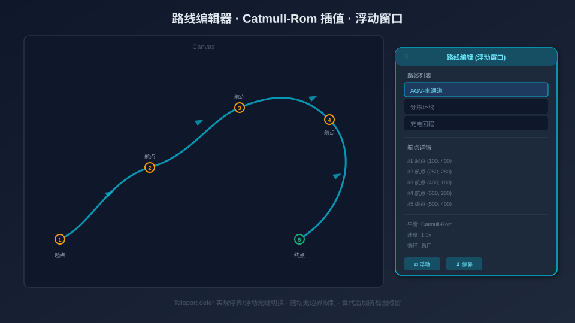

# 从零搭建仓储自动化 SCADA 组态平台（四）：路线编辑器与浮动窗口

> 本系列第 4 篇，拆解路线编辑器的完整实现：路线数据模型设计、画布上的路线绘制与编辑、浮动窗口的拖拽缩放、Vue 3 `<Teleport defer>` 实现停靠/浮动无感切换，以及路线高亮渲染。



## 一、为什么需要独立的路线编辑器

在仓储自动化中，AGV、穿梭车、堆垛机等设备都沿着预定义的路径运动。这些路径就是**路线（Route）**——由一系列航点（Waypoint）和分段配置（Segment）组成的独立实体。

路线与节点是**解耦**的：一个路线可以被多个节点引用（比如 3 台 AGV 共享同一条路线），节点通过 `routeId` 引用路线。这种设计避免了把路线数据硬编码在节点里导致的重复和维护困难。

路线编辑器提供两种工作模式：**列表编辑**（在表格中修改航点坐标和分段参数）和**画布绘制**（直接在画布上点击添加航点，所见即所得）。

## 二、路线数据模型

```typescript
// stores/route.ts
interface RouteWaypoint {
  x: number
  y: number
  type?: 'waypoint' | 'station'   // 普通航点 or 站点
  stationName?: string             // 站点名称
}

interface RouteSegment {
  speed?: number                   // 该段速度覆盖（不设用路线默认）
  direction: 'forward' | 'backward' | 'both'
  action?: {
    dwell: number                  // 到达 to 点时的停顿（ms）
    event?: string                 // 触发事件名
  }
}

interface RouteDefinition {
  id: string
  name: string
  points: RouteWaypoint[]
  segments: RouteSegment[]         // 长度 = points.length - 1（+1 if loop）
  speed: number                    // 默认速度（px/s）
  loop: boolean                    // 是否循环
  smooth: boolean                  // 是否贝塞尔平滑
}
```

路线存储在独立的 Pinia store（`routeStore`）中，持久化通过 `fileStorage` 落盘为应用配置目录下的 `routes.json`（tauri-plugin-fs 原子写入，浏览器开发环境回退 localStorage）。加载时做了向后兼容处理——旧数据缺少 `segments`、`smooth` 字段时自动补默认值。

分段配置的设计遵循一个原则：**segments 的长度始终与航点数量匹配**。`syncSegments()` 函数在增删航点后自动调整分段数组长度，确保数据一致性。

## 三、画布上的路线绘制

路线编辑器的核心交互是**画布绘制模式**：用户点击「绘制」按钮进入绘制状态，然后在画布上依次点击添加航点。

### 绘制状态机

```
空闲 → [点击绘制按钮] → 等待点击
等待点击 → [点击画布] → 添加航点 → 等待点击（继续）
等待点击 → [右键/ESC] → 结束绘制 → 空闲
```

绘制模式下，画布的 `blank:click` 事件被拦截：

```typescript
// RouteEditorDialog.vue
graph.on('blank:click', (e) => {
  if (!drawing.value) return
  const pos = graph.clientToLocal(e.clientX, e.clientY)
  routeStore.updateRoute(selectedRouteId.value, {
    points: [...currentRoute.points, { x: pos.x, y: pos.y }]
  })
})
```

### 覆盖层渲染

航点和线段不是 X6 的标准节点/边——它们是**覆盖层（overlay）**，用 X6 的底层 API 直接操作 SVG DOM。这样做的目的是避免路线编辑元素与业务节点混在一起，方便独立管理和清理。

每次路线数据变化时，`renderOverlay()` 重新生成覆盖层：

```typescript
function renderOverlay() {
  clearOverlay()  // 先清除旧的

  const cells: Cell[] = []
  const points = currentRoute.points

  // 绘制线段
  for (let i = 0; i < points.length - 1; i++) {
    const edge = graph.createEdge({
      id: `__route_editor_seg${i}_g${overlayGen}`,  // 带 generation 后缀
      shape: 'edge',
      source: { x: points[i].x, y: points[i].y },
      target: { x: points[i + 1].x, y: points[i + 1].y },
      attrs: { line: { stroke: '#9254de', strokeWidth: 3.5, opacity: 1 } },
    })
    cells.push(edge)
  }

  // 绘制航点标记
  points.forEach((p, i) => {
    const isStation = p.type === 'station'
    const dot = graph.createNode({
      id: `__route_editor_wp${i}_g${overlayGen}`,
      shape: 'circle',
      x: p.x, y: p.y, width: isStation ? 14 : 10, height: isStation ? 14 : 10,
      attrs: {
        body: {
          fill: isStation ? '#1f1f1f' : '#9254de',
          stroke: '#fff', strokeWidth: 2,
        }
      },
    })
    cells.push(dot)

    // 坐标标签（可选显示）
    if (showLabels.value) {
      const label = graph.createNode({
        id: `__route_editor_lbl${i}_g${overlayGen}`,
        shape: 'rect',
        x: p.x + 10, y: p.y - 20, width: 80, height: 20,
        attrs: { body: { fill: 'transparent', stroke: 'transparent' }, label: { text: `(${p.x},${p.y})` } },
      })
      cells.push(label)
    }
  })

  graph.resetCells([...graph.getCells(), ...cells])
}
```

### Generation 后缀：解决 X6 的 stale view 泄漏

注意 cell ID 中的 `_g${overlayGen}` 后缀。这是解决 X6 渲染器一个隐蔽 bug 的关键。

X6 v3 的渲染调度器（scheduler）会按 cell ID 合并待处理的渲染任务。如果先 `remove` 再 `add` 一个同 ID 的 cell，调度器会把 remove 任务合并掉（只保留最新的 add 回调），导致旧的 SVG 元素残留在 DOM 中。

解决方案：每次重新渲染覆盖层时递增 `overlayGen` 计数器，让所有 cell ID 都带上新的 generation 后缀。这样新旧 cell 的 ID 不同，X6 的合并策略不会误删 remove 任务。

```typescript
let overlayGen = 0
function clearOverlay() {
  const prefix = '__route_editor_'
  const toRemove = graph.getCells().filter(c => c.id.startsWith(prefix))
  if (toRemove.length) graph.removeCells(toRemove)
  overlayGen++
}
```

### resetCells 的陷阱

`graph.resetCells(cells)` 有一个容易踩的坑：它内部调用 `collection.reset()`，会对**不在新数组中的旧 cell** 执行 `cell.remove() → dispose() → store.dispose()`。如果你把同一批 cell 传回去（`graph.resetCells(graph.getCells())`），这些 cell 会被 dispose 掉，模型数据损坏（`shape=""`、`attrs={}`）。

正确做法：`graph.resetCells([...graph.getCells(), ...newCells])`——展开为新数组，让 `resetCells` 看到的是一个全新的引用。

## 四、浮动窗口：拖拽与缩放

路线编辑器可以脱离底部面板，变成画布上的浮动窗口。`RouteFloatWindow.vue` 实现了这个浮动容器。

### 拖拽实现

拖拽通过标题栏（`.rfw-header`）的 `pointerdown` 事件启动，在 `window` 上监听 `pointermove` 和 `pointerup`：

```typescript
function onDragStart(e: PointerEvent) {
  if ((e.target as HTMLElement).closest('button')) return  // 按钮上不触发拖拽
  e.preventDefault()
  const startX = e.clientX, startY = e.clientY
  const origX = pos.x, origY = pos.y

  const onMove = (ev: PointerEvent) => {
    pos.x = origX + (ev.clientX - startX)
    pos.y = origY + (ev.clientY - startY)
    // 不做边界限制：允许窗口拖到任意位置（包括移出浏览器可视区域）
  }
  const onUp = () => {
    window.removeEventListener('pointermove', onMove)
    window.removeEventListener('pointerup', onUp)
  }
  window.addEventListener('pointermove', onMove)
  window.addEventListener('pointerup', onUp)
}
```

关键设计决策：**不做边界限制**。窗口可以自由拖出浏览器可视区域——这是用户的明确要求，用于多显示器场景下把编辑器拖到另一个屏幕上。

为什么用 `window` 级监听而不是 `setPointerCapture`？因为合成事件（测试用的 `new PointerEvent`）在某些环境下不支持 pointer capture。window 级监听更健壮。

### 缩放实现

右下角的缩放手柄（`.rfw-resize`）用同样的模式，只约束最小尺寸：

```typescript
const MIN_W = 400, MIN_H = 240

function clampSize() {
  size.w = Math.max(size.w, MIN_W)
  size.h = Math.max(size.h, MIN_H)
}

function onResizeStart(e: PointerEvent) {
  e.preventDefault(); e.stopPropagation()
  const startX = e.clientX, startY = e.clientY
  const origW = size.w, origH = size.h

  const onMove = (ev: PointerEvent) => {
    size.w = origW + (ev.clientX - startX)
    size.h = origH + (ev.clientY - startY)
    clampSize()  // 只约束最小尺寸，不约束位置
  }
  // ...
}
```

注意：缩放时**不约束位置**。如果用 `clampAll()`（同时约束位置和尺寸），一个拖到屏幕边缘的窗口在缩放时会被弹回容器内——这不符合「自由浮动」的设计意图。

## 五、Teleport 的巧妙运用：停靠/浮动无感切换

这是整个路线编辑器最精妙的设计。路线编辑器（`RouteEditorDialog`）是一个组件实例，它可以在底部面板（停靠）和浮动窗口之间切换——**切换时组件状态不丢失**（选中的路线、绘制模式、滚动位置都保留）。

### 实现原理

`MainLayout.vue` 中，`RouteEditorDialog` 只渲染一次，通过 `<Teleport>` 动态切换挂载目标：

```html
<!-- MainLayout.vue -->
<BottomPanel v-show="!editorStore.routeFloating">
  <div id="bottom-panel-content"></div>
</BottomPanel>

<RouteFloatWindow v-show="editorStore.routeFloating"
  @dock="onFloatDock" @close="onFloatClose" />

<Teleport defer
  :to="editorStore.routeFloating ? '#route-float-body' : '#bottom-panel-content'">
  <RouteEditorDialog :canvas-ref="canvasRef" :active="routeActive" />
</Teleport>
```

当 `routeFloating` 从 `false` 变为 `true` 时，Teleport 的 `:to` 从 `#bottom-panel-content` 变为 `#route-float-body`。Vue 把同一个组件实例从旧容器移到新容器——**不销毁、不重建**，所有内部状态（`ref`、`reactive`、事件监听器）完整保留。

### 为什么需要 `defer`

`defer` 是 Vue 3.5 引入的 Teleport 属性。它延迟 Teleport 的挂载，直到当前渲染周期结束。

为什么需要它？因为 Teleport 的目标元素（`#bottom-panel-content`）是由子组件 `BottomPanel` 渲染的。在父组件 `MainLayout` 挂载时，子组件还没渲染完，目标元素不存在。没有 `defer` 的话，Teleport 会报 "Failed to locate Teleport target" 错误。

```
MainLayout 挂载
  ├── BottomPanel 挂载（渲染 #bottom-panel-content）
  ├── RouteFloatWindow 挂载（渲染 #route-float-body）
  └── Teleport defer → 等子组件渲染完 → 找到目标 → 挂载 RouteEditorDialog
```

### 激活状态控制

```typescript
const routeActive = computed(() =>
  editorStore.routeFloating ? true : !editorStore.bottomCollapsed
)
```

浮动模式下编辑器始终激活；停靠模式下只有底部面板展开时才激活。编辑器在 `active` 变为 `false` 时清除覆盖层和高亮，变为 `true` 时恢复——避免不可见时的无效渲染。

### 切换交互

- 底部面板标题栏的 **⧉ 按钮**：`editorStore.setRouteFloating(true)` → 进入浮动
- 浮动窗口标题栏的 **⬇ 按钮**：`setRouteFloating(false)` + `setBottomCollapsed(false)` → 回到底部并展开
- 浮动窗口标题栏的 **✕ 按钮**：`setRouteFloating(false)` + `setBottomCollapsed(true)` → 回到底部并折叠

## 六、路线高亮渲染

在路线列表中选中某条路线时，画布上会高亮显示该路线——粗亮线 + 发光效果 + 航点光晕，其他路线变暗。

`X6Canvas.vue` 暴露了 `highlightRoute(routeId)` 方法，内部实现是**三态渲染**：

- **高亮态**（选中路线）：线段 `strokeWidth: 5`、`stroke: '#1890ff'`，附加发光边（glow edge，`strokeWidth: 12`、`opacity: 0.3`），航点带光晕（halo，`strokeWidth: 8`、`opacity: 0.4`）
- **暗淡态**（其他路线）：`opacity: 0.15`
- **正常态**（无选中时）：默认样式

高亮渲染同样使用 generation 后缀的 cell ID（`_g${pathRenderGen}`），避免 stale view 泄漏。

## 七、小结

路线编辑器的核心设计决策：

1. **路线与节点解耦**：路线是独立实体，通过 `routeId` 被节点引用，支持复用。
2. **Generation 后缀**：解决 X6 渲染调度器的 stale view 合并 bug。
3. **Teleport defer**：同一个组件实例在停靠/浮动容器间无感切换，状态完整保留。
4. **自由拖拽**：不做边界限制，支持多显示器场景。
5. **三态高亮**：选中路线高亮 + 发光，其他路线暗淡，视觉层次清晰。

---

**上一篇**：[（三）多协议数据接入体系：7 种协议如何统一抽象](03-多协议数据接入体系.md)
**下一篇**：[（五）SCADA 运行态与单循环动画引擎](05-SCADA运行态与动画引擎.md)
