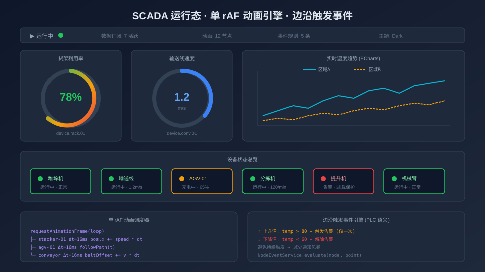

# 从零搭建仓储自动化 SCADA 组态平台（五）：SCADA 运行态与单循环动画引擎

> 本系列最终篇。从编辑态到运行态的切换机制、单 requestAnimationFrame 循环驱动的动画引擎、数据订阅的生命周期管理、PLC 语义的边沿触发事件系统，以及主题切换与生产部署。



## 一、从编辑态到运行态

编辑器中精心编排的画面——设备节点、数据绑定、路线规划、告警规则——最终都要投入实际使用。点击工具栏的「运行」按钮，画面切换到 SCADA 运行态：全屏展示、隐藏编辑工具、数据服务持续订阅、节点实时刷新。

### 数据交接

编辑态和运行态是两个完全独立的路由页面（`/` 和 `/run`），它们之间通过**预览快照文件**交接数据：

```typescript
// EditorToolbar.vue - 点击「▶ 预览」
async function handleRun() {
  // 1. 序列化当前画布
  const data = serializeGraph(props.graph)

  // 2. 写入预览快照文件（应用配置目录，tauri-plugin-fs 原子写入）
  const ok = await writeJsonFile('run-preview.json', data)
  if (!ok) return

  // 3. 在新窗口打开运行态页面
  window.open(`${window.location.origin}/run`, '_blank')
}
```

```typescript
// views/RunView.vue - onMounted
const data = await readJsonFile<{ nodes: any[]; edges: any[] }>('run-preview.json')
if (!data || !data.nodes || data.nodes.length === 0) return

// 用 X6 重建画布
graph.fromJSON({ cells: [...data.nodes, ...data.edges] })
```

早期版本用 `sessionStorage` 交接，桌面化后改为文件落盘：文件容量不受 5MB 限制（大画面含自定义图标时容易撑爆），且新窗口读取可靠。运行态是完全**只读**的——`Graph` 实例创建时 `interacting: false`，禁用所有编辑交互（但保留平移和缩放）。它从快照文件接收一份冻结画面，不连接编辑态的 Pinia store，编辑器后续修改不会影响已打开的运行态。

### 运行态的数据订阅

虽然运行态不连接 editorStore，但数据订阅是独立的——`RunView.vue` 同样使用 `useDataService` 组合式函数：

```typescript
// RunView.vue
const dataService = useDataService()

// 画布重建后，遍历所有节点重新建立数据绑定
// （读取每个节点 data.binding.pointId，订阅并自动写入 node.data.value）
dataService.bindAllNodes(graph)

// 组件卸载时清理：取消全部订阅并断开所有数据服务
onBeforeUnmount(() => { dataService.dispose() })
```

编辑态和运行态共享同一套数据服务基础设施（`IDataService` 接口 + 各协议实现 + 服务缓存），但各自维护独立的服务实例生命周期。

### 虚拟渲染

运行态启用了 X6 的虚拟渲染：`virtual: { enabled: true, margin: 150 }`。对于包含数百个节点的大型 SCADA 画面，只有视口附近 150px 范围内的节点会被实际渲染到 DOM，大幅降低内存占用和渲染开销。

## 二、单循环动画引擎

SCADA 画面中，设备节点需要动画来表达运行状态：指示灯闪烁、运行设备呼吸脉冲、风扇类部件旋转。如果每个节点各自启动 `setInterval`，100 个节点就是 100 个定时器——性能灾难。

### 设计：一个 rAF 驱动所有动画

`AnimationService` 用**单个 `requestAnimationFrame` 循环**统一调度所有节点的动画：

```typescript
// services/AnimationService.ts
type AnimationType = 'pulse' | 'blink' | 'rotate' | 'none'

class AnimationService {
  private animations = new Map<string, AnimationState>()
  private frameId: number | null = null

  setAnimation(nodeId: string, config: AnimationConfig) {
    this.stopAnimation(nodeId)  // 先停旧动画并恢复原始样式
    const cell = this.graph.getCellById(nodeId)
    if (!cell?.isNode()) return

    this.animations.set(nodeId, {
      config,
      node: cell as Node,
      startTime: performance.now(),
      visible: true,
    })
    this.ensureLoop()  // 懒启动：有动画时才启动 rAF 循环
  }

  stopAnimation(nodeId: string) {
    const state = this.animations.get(nodeId)
    if (!state) return
    this.resetNodeStyle(state.node)  // node.attr('body', { transform: '', opacity: 1 })
    this.animations.delete(nodeId)
    // 最后一个动画停止时关闭 rAF 循环
    if (this.animations.size === 0) this.stopLoop()
  }

  private ensureLoop() {
    if (this.frameId !== null) return
    const tick = (now: number) => {
      for (const state of this.animations.values()) {
        this.updateAnimation(state, now)
      }
      // 仍有动画时继续循环，否则自然停止
      this.frameId = this.animations.size > 0 ? requestAnimationFrame(tick) : null
    }
    this.frameId = requestAnimationFrame(tick)
  }
}
```

### 基于时间的动画（帧率无关）

动画进度基于**经过时间**计算，而不是帧数：

```typescript
private updateAnimation(state: AnimationState, now: number) {
  const { config, node } = state
  const interval = config.interval || config.duration || 1000
  const elapsed = now - state.startTime

  switch (config.type) {
    case 'pulse': {
      // 呼吸脉冲：缩放 + 透明度同步正弦变化
      const phase = (elapsed / interval) % 1
      const scale = 1 + 0.08 * Math.sin(phase * Math.PI * 2)
      const opacity = 0.7 + 0.3 * Math.sin(phase * Math.PI * 2)
      node.attr('body', { transform: `scale(${scale})`, opacity })
      break
    }
    case 'blink': {
      // 闪烁：每 interval/2 切换一次透明度（状态不变时不重复设 attr）
      const shouldBeVisible = Math.floor(elapsed / (interval / 2)) % 2 === 0
      if (shouldBeVisible !== state.visible) {
        state.visible = shouldBeVisible
        node.attr('body', { opacity: shouldBeVisible ? 1 : 0.2 })
      }
      break
    }
    case 'rotate': {
      // 缓慢旋转：每 interval 转 90°
      const angle = ((elapsed / interval) * 90) % 360
      node.attr('body', { transform: `rotate(${angle}deg)` })
      break
    }
  }
}
```

注意动画作用在 X6 节点的 `body` 属性上（`node.attr('body', ...)`），而不是直接操作 DOM——这样 X6 的渲染器能正确跟踪样式状态，停止动画时 `resetNodeStyle` 一步恢复原样。

基于时间意味着：无论显示器是 60Hz 还是 144Hz，无论帧率是否波动，动画的视觉速度始终一致。60Hz 屏幕上每帧前进 16.7ms，144Hz 屏幕上每帧前进 6.9ms，但经过 1 秒后的动画进度都是 100%。

### 生命周期管理

动画服务的生命周期与画布绑定：

- **运行态启动**：`RunView` 在画布加载完成后调用 `applyAllAnimations()`，遍历所有节点，把 `data.animation` 配置交给 `setAnimation`
- **编辑态添加节点**：`useGraphSync` 的 `cell:added` 回调（`onNodeAdded`）检查节点是否配置了动画，有则启动
- **节点删除时**：`cell:removed` 回调清理对应动画与资源
- **画布销毁时**：`dispose()` 恢复所有节点样式、停止 rAF

当没有活跃动画时，rAF 循环完全停止——不消耗 CPU。

## 三、PLC 语义的边沿触发事件

SCADA 系统中的告警不应该持续触发——一个温度超限告警应该在**温度从正常变为超限时触发一次**，而不是在温度持续超限时每秒都报一次。这就是 PLC 编程中的**边沿触发**概念。

### 事件模型

```typescript
// services/NodeEventService.ts
type EventCondition = 'changed' | 'gt' | 'lt' | 'gte' | 'lte' | 'eq' | 'neq'
type EventActionType = 'console' | 'alert' | 'http'

interface NodeEventRule {
  id: string
  enabled: boolean
  name: string
  field: string              // 监听的数据字段（空字符串 = 顶层 value）
  condition: EventCondition  // 触发条件
  threshold: string          // 阈值（比较类条件使用）
  actionType: EventActionType
  message?: string           // alert 动作的告警内容
  url?: string               // http 动作的请求地址
  method?: string
}
```

- **值变化（changed）**：字段值每次变化都触发
- **比较类条件（gt / lt / gte / lte / eq / neq）**：**上升沿触发**——仅在从「不满足」变为「满足」的瞬间触发一次

### 评估引擎

数据绑定每次写入节点后，`useDataService` 的订阅回调会调用 `evaluateNodeEvents(nodeId, oldData, newData)` 评估全部规则：

```typescript
// 记录每条规则上一次的条件匹配状态（key: `${nodeId}:${ruleId}`）
const prevMatchState = new Map<string, boolean>()

export function evaluateNodeEvents(nodeId: string, oldData: any, newData: any) {
  const rules = newData?.events
  if (!Array.isArray(rules) || rules.length === 0) return

  for (const rule of rules) {
    if (!rule?.enabled) continue

    const oldVal = getFieldValue(oldData, rule.field)  // field 为空取顶层 value
    const newVal = getFieldValue(newData, rule.field)
    const matched = matchCondition(rule, oldVal, newVal)

    const stateKey = `${nodeId}:${rule.id}`
    const prev = prevMatchState.get(stateKey) || false
    prevMatchState.set(stateKey, matched)

    // 「值变化」每次变化触发；比较类条件仅上升沿触发
    const shouldFire = rule.condition === 'changed' ? matched : matched && !prev
    if (shouldFire) executeAction(rule, newData, nodeId)
  }
}
```

边沿检测的关键是 `prevMatchState` 这个模块级 Map：每条规则维护一个布尔状态（上一次条件是否满足），只有从 `false → true` 的瞬间才执行动作。状态存在服务模块内而不是节点 data 上——避免事件状态写入画布数据污染序列化结果。动作支持三种：`console`（日志）、`alert`（弹窗告警）、`http`（POST 通知外部系统）。

### 事件配置 UI

`PropertyPanel.vue` 的事件标签页提供了可视化的规则编辑器：

```
┌─────────────────────────────────────┐
│  节点事件                            │
│  ┌─────────────────────────────────┐│
│  │ + 添加规则                      ││
│  │                                 ││
│  │ 规则 1: 温度过高告警            ││
│  │ 条件: [大于 ▼]                 ││
│  │ 字段: [temperature       ]     ││
│  │ 阈值: [80                ]     ││
│  │ 动作: [告警 ▼]                 ││
│  │                         [删除]  ││
│  └─────────────────────────────────┘│
└─────────────────────────────────────┘
```

事件规则存储在节点的 `data.events` 中，随画布数据一起序列化和持久化。`useNodeEvents` 组合式函数管理规则的加载、编辑和提交——采用 draft-then-commit 模式，编辑在草稿上进行，确认后自动提交到 X6 节点和 Store。

## 四、主题系统

项目内置 3 套主题：`industrial`（深蓝工业风，默认）、`light`（明亮）、`ocean`（海洋蓝）。

### CSS 变量驱动

主题切换完全通过 CSS 自定义属性实现：

```css
[data-theme="industrial"] {
  --panel-bg: #1a1d23;
  --text-primary: #e8e8e8;
  --border-color: #2d3039;
  --canvas-bg: #0f1117;
  --accent: #1890ff;
  /* ... 30+ 变量 */
}

[data-theme="light"] {
  --panel-bg: #ffffff;
  --text-primary: #1f1f1f;
  --border-color: #e8e8e8;
  --canvas-bg: #f5f5f5;
  --accent: #1890ff;
}
```

`<html data-theme="industrial">` 上的属性切换触发全局样式响应。所有组件通过 `var(--panel-bg)` 等引用主题变量，不需要任何 JavaScript 逻辑。

### 画布主题同步

X6 画布的背景色和网格颜色不直接受 CSS 变量控制（X6 用自己的渲染引擎）。`X6Canvas.vue` 通过 `MutationObserver` 监听 `data-theme` 属性变化，读取对应的 CSS 变量值，然后调用 `graph.setBackgroundColor()` 和 `graph.setGrid()` 更新画布：

```typescript
const observer = new MutationObserver((mutations) => {
  if (mutations.some(m => m.attributeName === 'data-theme')) {
    const style = getComputedStyle(document.documentElement)
    graph.setBackgroundColor(style.getPropertyValue('--canvas-bg').trim())
    graph.setGrid({
      color: style.getPropertyValue('--grid-color').trim(),
    })
  }
})
observer.observe(document.documentElement, { attributes: true })
```

## 五、打包与部署

### 构建

```bash
# 前端产物：vue-tsc 类型检查 + vite build → dist/
npm run build

# 桌面安装包：前端产物 + Rust 网关一起打包（NSIS 安装包 / 免安装版）
npx tauri build
```

前端构建产物是纯静态文件（HTML + CSS + JS），由 Tauri 在运行时通过自定义协议加载；Rust 侧的网关 crate 编译进主程序，整个应用只有一个可执行文件。

### 部署

没有服务器、没有 Nginx——安装包拷到车间工控机或办公室 PC，双击即用。工程数据（画布 / 数据源 / 路线 / 主题 / 运行预览快照）全部落盘在应用配置目录（Windows 下为 `%APPDATA%\com.rocwes.desktop\`），卸载前随时备份。

### 连接真实设备

1. 在数据源管理对话框中新建对应协议的数据源，设备/服务地址统一填在「地址」栏（Modbus/S7 写 `主机[:端口]`，OPC UA 写端点 URL），协议专属参数（如 Modbus 从站地址 unitId / 轮询间隔）单独配置。
2. 保存后，`IpcGatewayService` 经 Tauri IPC 请求 Rust 网关建立会话，网关用 tokio 原生 TCP 直连 PLC，遥测数据批量推回前端。

当前 Modbus / S7 / OPC UA 适配器均已落地（tokio-modbus / snap7-client / opcua crate），7 类协议真实模式全通。连接失败时，数据源监控面板会实时展示错误原因。

### 未来演进方向

**写操作与多寄存器数据类型**：网关适配器当前只读、每点 1 个寄存器；32 位浮点/整数拆分读写是下一步演进方向。

**串口直连（Modbus RTU）**：桌面化后具备 RS-485 串口能力，可为 gateway-core 增加 RTU 适配器，覆盖存量串口仪表。

**后端持久化 / 多用户协作**：当前工程数据落盘在本地 JSON 文件。若需多用户协作、项目版本管理，可把 `editorStore.graphData` 等序列化后存数据库；`IDataService` 接口也可以扩展 `HttpApiService` 实现对接 RESTful 后端。

**移动端查看**：X6 画布在移动端浏览器上可以只读展示。若移动端监控是刚需，可以做一个轻量的 H5 运行态页面，只展示关键设备和数据。

## 六、系列总结

回顾这 5 篇文章，我们从架构设计到实现细节，完整拆解了 roc-wes 的核心实现：

| 篇目 | 核心内容 | 关键技术点 |
|------|----------|------------|
| 第 1 篇 | 项目总览与架构设计 | 四层架构、7 协议统一接入、技术选型 |
| 第 2 篇 | 画布编辑器核心实现 | X6 集成、节点注册表、配置驱动工厂、双向同步防循环 |
| 第 3 篇 | 多协议数据接入体系 | IDataService、IpcGatewayService IPC 网关、Transform 序列化 |
| 第 4 篇 | 路线编辑器与浮动窗口 | Generation 后缀、Teleport defer、自由拖拽 |
| 第 5 篇 | SCADA 运行态与动画引擎 | 单 rAF 循环、边沿触发事件、主题系统 |

整个项目的设计哲学可以归纳为几个核心原则：

**接口驱动的多态**：`IDataService` 让 7 种协议对节点组件透明。

**配置驱动的工厂**：`NodeTemplate` 数组取代了 200 行的 if-else。

**单一数据源 + 防循环同步**：Store 是唯一真相源，5 个标志位守护画布与 Store 的边界。

**时间驱动的动画**：一个 rAF 循环取代 N 个定时器，帧率无关。

**边沿触发的事件**：PLC 语义的状态变化检测，避免告警风暴。

希望这个系列对你的 SCADA / 组态 / 可视化编辑器项目有启发。项目开源，欢迎 Star 和贡献。

---

**上一篇**：[（四）路线编辑器与浮动窗口：Teleport 的巧妙运用](04-路线编辑器与浮动窗口.md)
**系列首篇**：[（一）项目总览与架构设计](01-项目总览与架构设计.md)
