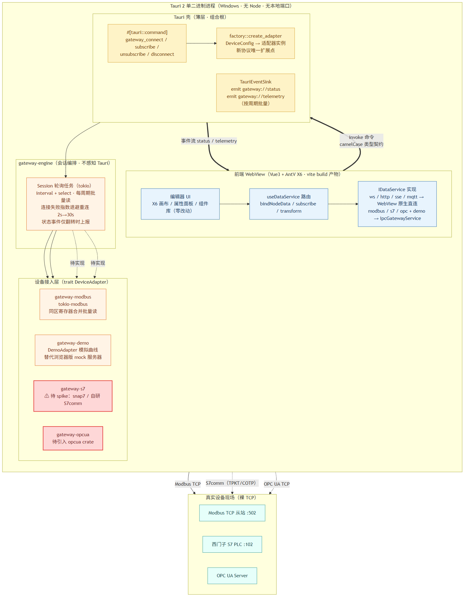
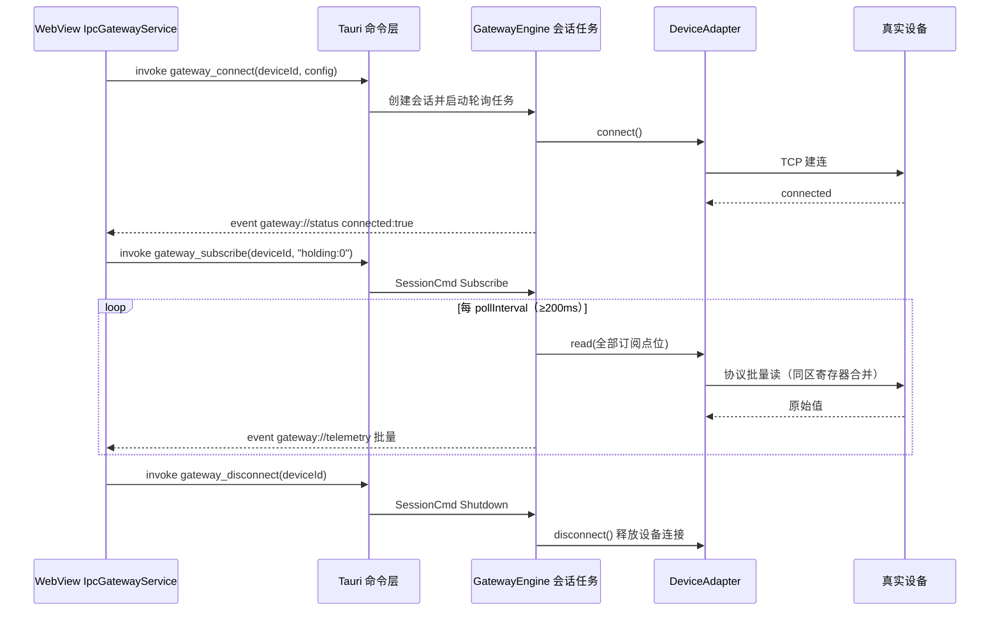

# RocWes → Tauri 2：目标架构（最佳实践 · IPC-first）

> 本文档取代 `tauri-迁移方案.md` 中的"B2 内嵌本地 WS 服务器"过渡方案。
> 新架构不再保留 WebSocket 协议与本地端口，改用 Tauri 原生 IPC（命令 + 事件流），
> Rust 侧按六边形架构分层，前端仅改动数据服务路由一处。



## 1. 设计原则

| 原则 | 落地方式 |
|---|---|
| 不保留过渡结构 | 没有内嵌 WS 服务器、没有本地端口、没有假服务器；浏览器时代的 `gateway/*.ts` 三个 Node 进程与 `mock/server.ts` 全部退役 |
| IPC-first | 前端 ↔ Rust 走 Tauri 原生 `invoke` 命令与 `listen` 事件流；无端口冲突、无防火墙提示、无其他进程可接入的安全暴露面 |
| 类型契约贯穿两端 | Rust 结构体 `#[serde(rename_all = "camelCase")]` ⇄ TypeScript 接口逐字段对齐；载荷即文档 |
| 六边形架构（端口-适配器） | 引擎只依赖 `DeviceAdapter`（驱动端口）与 `EventSink`（被驱动端口）两个 trait；Tauri、tokio-modbus 均为可替换适配器 |
| 前端最小侵入 | UI 与业务逻辑零改动；`IDataService` 接口不变，只在 `useDataService` 路由处按运行时环境选择传输 |
| 批量与节流 | 遥测按轮询周期批量推送（每设备每周期 1 次 IPC）；轮询间隔下限 200ms；状态事件仅在连接状态翻转时上报 |
| 可测试性 | 引擎与适配器不依赖 Tauri，`cargo test` 即可注入内存 EventSink / 假适配器做闭环测试 |

## 2. 总体分层


### 2.1 Cargo workspace 布局

```
src-tauri/
├─ Cargo.toml              # workspace 根 + Tauri 应用包（roc-wes-desktop）
├─ build.rs                # tauri_build
├─ tauri.conf.json         # 窗口 / CSP（含 unsafe-eval，见 §6）/ NSIS 打包
├─ capabilities/default.json
├─ src/                    # —— Tauri 壳（薄层，组合根）——
│  ├─ main.rs / lib.rs     #   组装引擎、注册命令、退出时会话清理
│  ├─ commands.rs          #   4 个 #[tauri::command]
│  ├─ factory.rs           #   DeviceConfig → 适配器（新协议唯一扩展点）
│  └─ state.rs             #   AppState + TauriEventSink + 事件名常量
└─ crates/
   ├─ gateway-core/        # 领域模型：DeviceConfig / Telemetry / Quality /
   │                       # GatewayError / trait DeviceAdapter（零 IO 依赖）
   ├─ gateway-engine/      # GatewayEngine：会话注册表、轮询任务、
   │                       # 指数退避重连、trait EventSink 端口
   ├─ gateway-modbus/      # ModbusAdapter（tokio-modbus）
   └─ gateway-demo/        # DemoAdapter（演示模式模拟数据）
   #（规划中）gateway-s7/  # snap7 绑定或自研 S7comm —— 风险最高，spike 前置
   #（规划中）gateway-opcua/ # opcua crate
```

依赖方向严格单向：`壳 → engine → core`，`适配器 crate → core`；
`engine` 不依赖任何具体适配器 crate（工厂在壳层）。

### 2.2 会话轮询任务状态机

每个设备会话 = 一个 tokio 任务，独占一个 `DeviceAdapter` 实例：

1. 未连接 → `connect()`：成功发 `status(true)`；失败发一次 `status(false)` 后按 2s→4s→…→30s 指数退避重试（等待期间仍响应订阅/退出指令）
2. 已连接 → 每个 `pollInterval`（下限 200ms）调用 `read(全部订阅点位)`，成功则批量推送 `telemetry`；失败则 `disconnect()` 并回到步骤 1
3. 收到 `Shutdown` → `disconnect()` 释放设备连接，任务退出

## 3. IPC 契约

### 3.1 命令（前端 → Rust，`invoke`）

| 命令 | 参数 | 语义 |
|---|---|---|
| `gateway_connect` | `deviceId: string, config: DeviceConfig` | 创建会话并异步连接（对应旧协议 open + configure） |
| `gateway_subscribe` | `deviceId, pointId` | 点位加入轮询集合 |
| `gateway_unsubscribe` | `deviceId, pointId` | 移出轮询集合 |
| `gateway_disconnect` | `deviceId` | 断开并销毁会话 |

`DeviceConfig`（判别字段 `kind`，camelCase）：

```jsonc
{ "kind": "modbus", "host": "192.168.1.10", "port": 502, "unitId": 1, "pollIntervalMs": 1000 }
{ "kind": "s7",     "host": "...", "port": 102, "rack": 0, "slot": 1, "pollIntervalMs": 1000 }
{ "kind": "opc",    "endpoint": "opc.tcp://...:4840", "pollIntervalMs": 1000 }
{ "kind": "demo",   "pollIntervalMs": 1000 }
```

### 3.2 事件（Rust → 前端，`listen`）

| 事件名 | 载荷 | 时机 |
|---|---|---|
| `gateway://status` | `{ deviceId, connected, message }` | 连接状态翻转时（不刷屏） |
| `gateway://telemetry` | `{ deviceId, points: [{ pointId, value, timestamp, quality }] }` | 每个轮询周期一批 |

`quality ∈ good | bad | uncertain`，时间戳为 Unix 毫秒 —— 与前端 `DataPoint` 完全对齐。

### 3.3 点位 ID 约定（与现有 Node 网关一致）

- Modbus：`holding:N` / `input:N` / `coil:N` / `discrete:N`
- S7：`db{n}.dbx{b}.{bit}` / `db{n}.dbw{w}` 等（沿用 nodes7 风格，待 spike 确认）
- OPC UA：`ns=2;s=...`

## 4. 订阅时序



## 5. 前端改动（唯一改动面）

| 文件 | 改动 |
|---|---|
| `src/platform/runtime.ts`（新增） | `isTauri()` 运行时探测（`__TAURI_INTERNALS__`） |
| `src/services/IpcGatewayService.ts`（新增） | 实现既有 `IDataService` 接口：invoke 命令 + 单例事件总线按 `deviceId` 分发；`@tauri-apps/api` 动态 import，浏览器构建零负担 |
| `src/composables/useDataService.ts` | `getDataService` 路由：桌面运行时下 modbus/s7/opc 及 demo 数据源 → `IpcGatewayService`；ws/http/sse/mqtt 真实地址仍走 WebView 原生连接 |
| 其余（UI、节点组件、属性面板、X6Canvas） | **零改动** |

浏览器开发模式不受影响：`npm run dev` 仍启动 mock 服务器与 Node 网关，行为与现在完全一致；桌面端由 `npm run tauri dev` 启动。

## 6. 已知要点

- **CSP**：`PropertyPanel.vue` 与 `useDataService.ts` 使用 `new Function` 编译 transform，`tauri.conf.json` 的 `script-src` 必须包含 `'unsafe-eval'`（已配置）
- **数据源记录中的 url 字段**：桌面模式下 modbus/s7/opc 的 url 不再被消费（传输走 IPC），保留仅为浏览器模式兼容与可读性
- **轮询下限**：引擎强制 ≥200ms，防止前端误配打满设备链路
- **持久化**：全部工程数据经 `src/platform/fileStorage.ts` 由 tauri-plugin-fs 落盘为应用配置目录下的 JSON 文件（`editor.json` / `datasources.json` / `routes.json` / `theme.json` / `run-preview.json`，原子写入防损坏）；localStorage / sessionStorage 已全面移除
- **退出清理**：`RunEvent::Exit` 时 `engine.shutdown()` 断开全部设备 TCP 连接

## 7. 与旧方案的差异（为什么放弃内嵌 WS）

| 维度 | 旧 B2：内嵌本地 WS（协议不变） | 新：IPC-first |
|---|---|---|
| 端口 | 需动态分配本地端口，注入前端 | 无端口 |
| 安全 | 本机任意进程可连接该 WS | IPC 仅限本 WebView |
| 类型安全 | 字符串 JSON 协议，两端各自维护 | serde ⇄ TS 类型逐字段对齐 |
| 演示模式 | 需内嵌 rumqttd 等假服务器 | `DemoAdapter` 实现同一 trait，零服务器 |
| 前端改动量 | 极小（注入端口） | 小（仅数据服务路由 + 一个 Service 实现） |
| 额外运行时代码 | WS 服务器 + 协议解析层 | 无（Tauri 内置） |

## 8. 当前实现状态与后续路线

已完成（本次落地）：

- Cargo workspace 全部骨架：`gateway-core`（模型 + trait）、`gateway-engine`（会话/轮询/重连/EventSink）、`gateway-modbus`（tokio-modbus 适配器，4 项单元测试）、`gateway-demo`（演示适配器）
- `gateway-engine` 端到端集成测试（`tests/demo_session.rs`）：DemoAdapter 全链路（connect → subscribe → 周期遥测 → unsubscribe → disconnect）、重复 connect 幂等保护、连接失败指数退避重连（退避期间订阅不丢、恢复后自动产出遥测）
- Tauri 壳：4 个 IPC 命令、事件分发、退出清理、CSP/窗口配置、应用图标（`icons/icon.ico`）
- 前端平台层：`isTauri()` + `IpcGatewayService` + useDataService 路由
- 开发链路打通：`@tauri-apps/cli` 已安装，`npx tauri dev` 首次完整编译并启动成功（WebView2 正常加载 vite dev server）
- Modbus / 演示模式在桌面端可用
- 代码清理（A+B+C）：移除 Node 网关 `gateway/`（约 1000 行）与 mock 工业桥接（端口 8084/8085/8086）、相关 scripts 与依赖（modbus-serial / node-opcua / nodes7 / tsx / ts-node）；`GatewayMonitorService` 工业类型在 Tauri 下改经 IPC 探测（独立 `mon:` 前缀会话，避免与业务会话冲突）；S7 slot 默认值统一为 2；clippy 零警告、workspace 测试 6/6 通过

后续（按风险排序）：

1. **S7 spike**（风险最高）：snap7 绑定 vs 自研 S7comm（TPKT/COTP 已有 JS 逆向经验），产出 `gateway-s7` 并在 factory 注册
2. OPC UA：引入 `opcua` crate，`gateway-opcua`
3. 打包：应用图标、NSIS 安装器、（可选）tauri-plugin-updater 自动更新
4. 日志落盘：tracing-appender 滚动文件（AppData）
