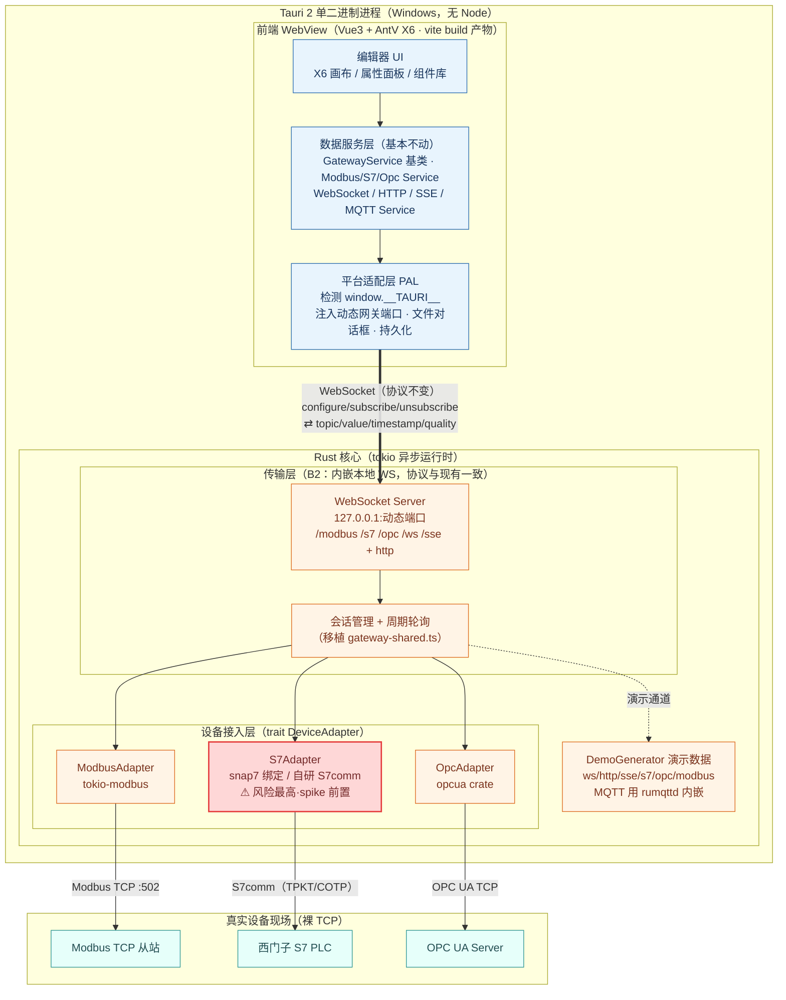
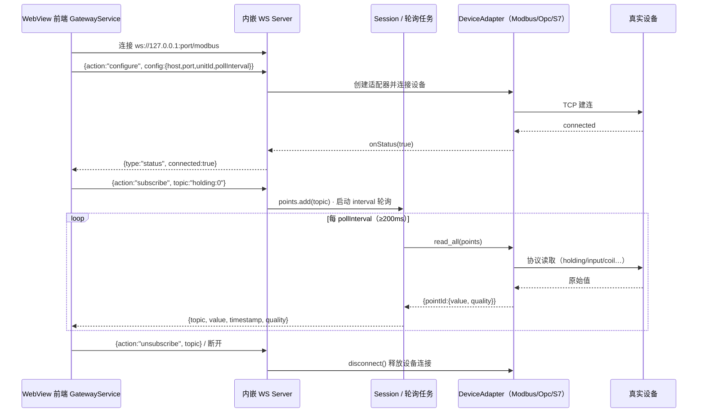

# roc-wes 迁移 Tauri 方案（已定稿方向：Rust 原生网关）

> 已确认决策：**网关策略 = B（Rust 原生重写）**；**目标平台 = 仅 Windows**；**演示模式 = 保留**。
> 目标：单一可分发 Windows 桌面应用，设备接入全部在 Rust 侧实现，无 Node 运行时。

---

## 0. 决策摘要与代价

| 决策 | 选择 | 含义 |
|---|---|---|
| 网关安置 | **B Rust 原生重写** | Modbus/S7/OPC UA 用 Rust crate 重做；无 Node、单文件、小体积 |
| 目标平台 | **仅 Windows** | 只打 NSIS/MSI；sidecar/交叉编译矩阵不需要 |
| 演示模式 | **保留** | mock 逻辑需从 Vite 插件迁到 Rust（演示数据源） |

**接受的代价**：工作量显著高于 sidecar 方案（约 4–7 周），且 **S7 的 Rust 生态薄弱是最大不确定项**——因此路线图把 S7 技术验证（spike）前置，避免到后期才发现走不通。

**有利条件**：现有 WS 协议与 `DeviceAdapter` 抽象非常干净（`gateway/gateway-shared.ts`），可直接作为 Rust 端的设计蓝本；你已有 S7comm 的 JS 逆向经验（TPKT/COTP/S7 PDU），可移植。

---

## 1. 目标架构

> 独立文件见 `docs/tauri-架构图.mermaid`。

**一次订阅的数据流（时序）**：

### 1.1 传输层子决策（重要）
Rust 重写设备层之余，前端↔后端的传输有两种选法：

- **方案 B2（推荐，起步用）：内嵌本地 WebSocket Server**，协议与现有 `{action:configure/subscribe/unsubscribe}` / `{topic,value,timestamp,quality}` **完全一致**。
  - 优点：前端 `GatewayService` 几乎零改动；演示/真实共用同一 WS 通道；Rust 网关可脱离 Tauri 单独跑起来先验证。
  - 代价：进程内监听一个本地端口（绑 127.0.0.1 即可）。
- **方案 B1（可选，后期加固）：改用 Tauri IPC（command/event）**，不占端口、安全域更干净。
  - 代价：前端服务层要从 WS 客户端改写成 IPC 客户端，风险叠加。

**建议**：先用 B2 把「Rust 设备接入」这件最难的事独立验证通过，再评估是否迁到 B1。不要把「换传输」和「重写设备层」两件高风险事同时做。

---

## 2. Rust 侧设计要点

### 2.1 技术选型
| 用途 | 选型 | 成熟度/备注 |
|---|---|---|
| 异步运行时 | `tokio` | 标配 |
| WS Server | `tokio-tungstenite`（配 `axum` 或裸 tokio） | 成熟 |
| Modbus TCP | `tokio-modbus` | 成熟，async，读 holding/input/coil/discrete |
| OPC UA | `opcua`（locka99） | 较成熟；订阅/安全策略配置较重，需预留时间 |
| S7 | `snap7` 绑定（需原生 snap7.dll，LGPL）**或** 自研 S7comm over TPKT/COTP | **生态最弱**，spike 后定 |
| MQTT（仅演示） | `rumqttd`（Rust broker） | 仅为保留演示；若嫌重可降级演示 mqtt |
| 序列化 | `serde` / `serde_json` | 标配 |

### 2.2 核心抽象（对齐现有 TS）
- `trait DeviceAdapter`：`is_ready()` / `add_point(id)` / `remove_point(id)` / `read_all(points) -> Map<pointId, PointResult>` / `disconnect()`。逐一对应 `gateway-shared.ts` 的接口，迁移心智成本最低。
- `Session`：每个 WS 连接一个会话（config、adapter、points 集合、轮询任务句柄），`configure` 时重建 adapter，`close` 时清理——与 TS 版行为一致。
- 轮询：`tokio::time::interval(max(200ms, pollInterval))`；设备未就绪则跳过本轮；按点回推 `good/bad`。

### 2.3 pointId 约定（保持不变）
- Modbus：`holding:N / input:N / coil:N / discrete:N`
- S7：nodes7 三段地址（DB1,REAL0 / MB0 / MR8）
- OPC UA：`ns=2;s=xxx` NodeId

---

## 3. 前端改造（最小化）

1. **平台适配层（PAL）**：检测 `window.__TAURI__` 分支；桌面下通过 Tauri command 获取 Rust 网关的**动态端口**，替代写死的 `REAL_GATEWAY_URLS`（现位于 `ModbusService / S7Service / OpcService / stores/dataSource.ts`）。保持 `vite` 浏览器开发流不变。
2. **文件导入导出**：EditorToolbar 的 Blob 下载 / FileReader → `tauri-plugin-dialog` + `tauri-plugin-fs`。图标上传可保留 WebView 内实现。
3. **持久化**：Phase 1 保持 `localStorage`；后续可选升级为「打开/保存 `.json` 工程文件」（更桌面化）。
4. **CSP**：`new Function`（transform 编译，2 处）需在 `tauri.conf.json` 的 `script-src` 加 `'unsafe-eval'`；长期可改为无 eval 的解释器。保留 `rackTransform.toString()` 可序列化前提。

---

## 4. S7 风险与对策（最高优先级）

- **现状**：Rust 侧 S7 生态薄弱，没有与 `nodes7` 等价的成熟纯 Rust 库。
- **对策**：**S7 spike 前置**（路线图中独立一步），二选一验证后再投入：
  - **路线①**：`snap7` 绑定 + 随包携带原生 snap7 库（成熟协议实现，代价是原生依赖与 LGPL）。
  - **路线②**：基于你已有的 S7comm JS 逆向，用 tokio 自研 TPKT/COTP/S7 PDU（无原生依赖、可控，但工作量与风险更高）。
- **止损**：若 spike 结论不理想，可先把 Modbus + OPC UA 上 Rust，S7 暂以独立方式兜底，避免整体阻塞。

---

## 5. 演示模式（保留）

- 把 `mock/generators.ts` 的信号发生器移植为 Rust `DemoGenerator`，通过内嵌 WS/HTTP/SSE 端点提供演示值（ws/http/sse/s7/opc/modbus 演示源）。
- MQTT 演示需一个 broker：用 `rumqttd` 内嵌，或评估「桌面版降级演示 mqtt」。
- 演示/真实切换逻辑（`demo` 标志）沿用现有前端行为，仅端点改由 Rust 提供。

---

## 6. 分阶段路线图（仅 Windows）

| 阶段 | 内容 | 预估 |
|---|---|---|
| **P0 脚手架** | `tauri init`(v2)、配 devUrl/5173 + outDir/dist；空壳加载现有前端 | 0.5–1 天 |
| **P1 前端平台层** | PAL、文件对话框、CSP(unsafe-eval)、持久化留 localStorage；网关先以占位/演示打通 UI | 2–3 天 |
| **P2 Rust 网关骨架** | tokio + 内嵌 WS Server；`DeviceAdapter` trait；会话/轮询框架（移植 gateway-shared） | 3–5 天 |
| **P3 Modbus 适配器** | `tokio-modbus`；端到端连仿真从站验证 | 2–4 天 |
| **P4 OPC UA 适配器** | `opcua` 客户端 + 订阅；连仿真 PLC 验证 | 3–6 天 |
| **P5 S7 适配器** | **spike 2–3 天**（snap7 vs 自研）+ 实现 5–10 天 | 7–13 天（方差最大） |
| **P6 演示生成器** | ws/http/sse 演示 1–2 天；MQTT(rumqttd) +2–4 天 | 3–6 天 |
| **P7 打包与桌面体验** | NSIS/MSI、图标、托盘、单实例、自启、可选 updater | 2–3 天 |

**合计约 20–35 人天（4–7 周）**，S7 是主要不确定来源。建议按 P0→P7 顺序推进，但 **P5 的 spike 可与 P3/P4 并行提前启动**，尽早暴露 S7 风险。

---

## 7. Windows 打包

- 前置：Rust ✅(1.95)、VS2022 ✅、Windows SDK ✅、Node ✅(22)、WebView2（Win10/11 自带）。
- `tauri build` → NSIS 安装包 + MSI；配 productName/version/图标。
- 仅 Windows：无交叉编译矩阵；暂不需要代码签名与自动更新（可作为 P7 可选项）。

---

## 8. 风险清单

| 风险 | 级别 | 缓解 |
|---|---|---|
| S7 Rust 生态弱 | **高** | spike 前置；snap7 vs 自研二选一；必要时 S7 后置兜底 |
| OPC UA crate 复杂度（安全策略/订阅） | 中 | 预留时间；先连仿真 PLC 跑通最小订阅 |
| 工作量超预期（B 固有风险） | 中 | 按阶段交付；每阶段可单独验证 |
| MQTT 演示需内嵌 broker | 低–中 | rumqttd；或降级演示 mqtt |
| CSP `unsafe-eval` 安全面 | 低 | 桌面内网可接受；长期做无 eval 解释器 |
| 会话/轮询重写引入行为差异 | 中 | 以 gateway-shared.ts 为蓝本逐条对齐 + 仿真回归 |

---

## 9. 下一步

1. 确认本路线图与 S7 spike 前置的安排。
2. 我可以从 **P0（Tauri 脚手架 + 空壳跑起现有前端）** 开始动手，同时给出 P5 的 S7 spike 验证脚本（snap7 绑定 vs 自研 S7comm 各写一个最小读取示例）。
3. 如需，我可以先把 `gateway-shared.ts → Rust DeviceAdapter/Session` 的骨架代码起出来，作为 P2 的起点。
