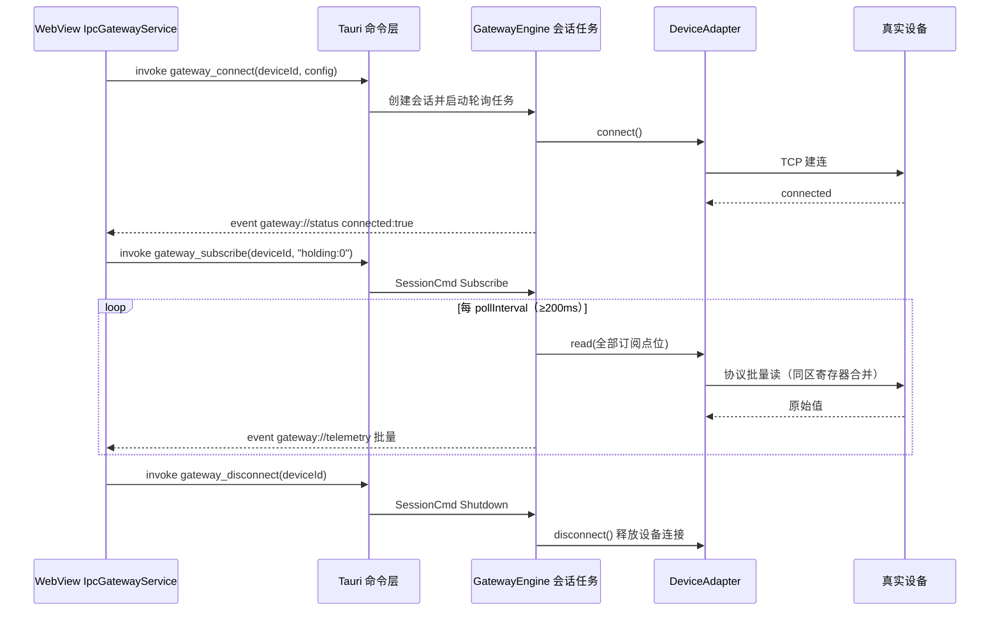

# RocWes → Tauri 2：目标架构（最佳实践 · IPC-first）

> 本文档取代 `tauri-迁移方案.md` 中的"B2 内嵌本地 WS 服务器"过渡方案。
> 新架构不再保留 WebSocket 协议与本地端口，改用 Tauri 原生 IPC（命令 + 事件流），
> Rust 侧按六边形架构分层，前端仅改动数据服务路由一处。


## 1. 设计原则

| 原则 | 落地方式 |
|---|---|
| 不保留过渡结构 | 没有内嵌 WS 服务器、没有本地端口、没有假服务器；浏览器时代的 `gateway/*.ts` 三个 Node 进程与 `mock/server.ts` 全部退役 |
| IPC-first | 前端 ↔ Rust 走 Tauri 原生 `invoke` 命令与 `listen` 事件流；无端口冲突、无防火墙提示、无其他进程可接入的安全暴露面 |
| 类型契约贯穿两端 | Rust 结构体 `#[serde(rename_all = "camelCase")]` ⇄ TypeScript 接口逐字段对齐；载荷即文档 |
| 六边形架构（端口-适配器） | 引擎只依赖 `DeviceAdapter`（驱动端口）与 `EventSink`（被驱动端口）两个 trait；Tauri、tokio-modbus 均为可替换适配器 |
| 前端最小侵入 | UI 与业务逻辑零改动；`IDataService` 接口不变，只在 `useDataService` 路由处按运行时环境选择传输 |
| 批量与节流 | 遥测按轮询周期批量推送（每设备每周期 1 次 IPC）；轮询间隔下限 200ms；状态事件仅在连接状态翻转时上报 |
| 可测试性 | 引擎与适配器不依赖 Tauri，`cargo test` 即可注入内存 EventSink / 假适配器做闭环测试 |

## 2. 总体分层


### 2.1 Cargo workspace 布局

```
src-tauri/
├─ Cargo.toml              # workspace 根 + Tauri 应用包（roc-wes-desktop）
├─ build.rs                # tauri_build
├─ tauri.conf.json         # 窗口 / CSP（含 unsafe-eval，见 §6）/ NSIS 打包
├─ capabilities/default.json
├─ src/                    # —— Tauri 壳（薄层，组合根）——
│  ├─ main.rs / lib.rs     #   组装引擎、注册命令、退出时会话清理
│  ├─ commands.rs          #   4 个 #[tauri::command]
│  ├─ factory.rs           #   DeviceConfig → 适配器（新协议唯一扩展点）
│  └─ state.rs             #   AppState + TauriEventSink + 事件名常量
└─ crates/
   ├─ gateway-core/        # 领域模型：DeviceConfig / Telemetry / Quality /
   │                       # GatewayError / trait DeviceAdapter（零 IO 依赖）
   ├─ gateway-engine/      # GatewayEngine：会话注册表、轮询任务、
   │                       # 指数退避重连、trait EventSink 端口
   ├─ gateway-modbus/      # ModbusAdapter（tokio-modbus）
   ├─ gateway-websocket/   # WebSocketAdapter（tokio-tungstenite，真实模式）
   ├─ gateway-http/        # HttpAdapter（reqwest 按点位 GET 轮询）
   ├─ gateway-sse/         # SseAdapter（reqwest 字节流，按点位建流）
   ├─ gateway-mqtt/        # MqttAdapter（rumqttc，主题过滤器订阅）
   ├─ gateway-common/      # Web 协议共享内核：帧解析 / 通配符匹配 / 最新值缓冲
   ├─ gateway-s7/          # S7Adapter（snap7-client，nodes7 风格点位合同）
   ├─ gateway-opcua/       # OpcuaAdapter（opcua crate，匿名 + SecurityPolicy None 轮询）
   └─ gateway-demo/        # DemoAdapter（演示模式模拟数据）
```

依赖方向严格单向：`壳 → engine → core`，`适配器 crate → core`（Web 协议适配器另依赖共享内核 `gateway-common`）；
`engine` 不依赖任何具体适配器 crate（工厂在壳层）。

### 2.2 会话轮询任务状态机

每个设备会话 = 一个 tokio 任务，独占一个 `DeviceAdapter` 实例：

1. 未连接 → `connect()`：成功发 `status(true)`；失败发一次 `status(false)` 后按 2s→4s→…→30s 指数退避重试（等待期间仍响应订阅/退出指令）
2. 已连接 → 每个 `pollInterval`（下限 200ms）调用 `read(全部订阅点位)`，成功则批量推送 `telemetry`；失败则 `disconnect()` 并回到步骤 1
3. 收到 `Shutdown` → `disconnect()` 释放设备连接，任务退出

## 3. IPC 契约

### 3.1 命令（前端 → Rust，`invoke`）

| 命令 | 参数 | 语义 |
|---|---|---|
| `gateway_connect` | `deviceId: string, config: DeviceConfig` | 创建会话并异步连接（对应旧协议 open + configure） |
| `gateway_subscribe` | `deviceId, pointId` | 点位加入轮询集合 |
| `gateway_unsubscribe` | `deviceId, pointId` | 移出轮询集合 |
| `gateway_disconnect` | `deviceId` | 断开并销毁会话 |

`DeviceConfig`（判别字段 `protocol`，camelCase；`isMock` 标识演示模式，`profile` 为演示波形档位）：

```jsonc
{ "protocol": "modbus", "host": "192.168.1.10", "port": 502, "unitId": 1, "pollIntervalMs": 1000 }
{ "protocol": "s7",     "host": "...", "port": 102, "rack": 0, "slot": 1, "pollIntervalMs": 1000 }
{ "protocol": "opc",    "endpoint": "opc.tcp://...:4840", "pollIntervalMs": 1000 }
{ "protocol": "websocket", "url": "ws://127.0.0.1:12345", "pollIntervalMs": 1000 }
{ "protocol": "http",   "url": "http://192.168.0.10:9000/data", "pollIntervalMs": 2000 }
{ "protocol": "sse",    "url": "http://192.168.0.10:9000/sse", "pollIntervalMs": 1000 }
{ "protocol": "mqtt",   "url": "ws://192.168.0.10:8083", "pollIntervalMs": 1000 }
// 演示模式不是独立协议：保持原协议类型 + isMock:true（profile 可选，缺省正弦）
{ "protocol": "websocket", "isMock": true, "profile": "sse", "url": "", "pollIntervalMs": 1000 }
```

### 3.2 事件（Rust → 前端，`listen`）

| 事件名 | 载荷 | 时机 |
|---|---|---|
| `gateway://status` | `{ deviceId, connected, message }` | 连接状态翻转时（不刷屏） |
| `gateway://telemetry` | `{ deviceId, points: [{ pointId, value, timestamp, quality }] }` | 每个轮询周期一批 |

`quality ∈ good | bad | uncertain`，时间戳为 Unix 毫秒 —— 与前端 `DataPoint` 完全对齐。

### 3.3 点位 ID 约定（与现有 Node 网关一致）

- Modbus：`holding:N` / `input:N` / `coil:N` / `discrete:N`
- S7：nodes7 风格地址（DB/M/I/Q 区标量与位；数组点 v2），见数据源手册 s7 §六
- OPC UA：`ns=2;s=...`
- WebSocket / HTTP / SSE：任意字符串（即订阅主题 / 轮询 pointId，需与服务端一致）
- MQTT：主题过滤器（支持 `+` / `#` 通配符），遥测 point_id 即订阅过滤器

## 4. 订阅时序



## 5. 前端改动（唯一改动面）

| 文件 | 改动 |
|---|---|
| `src/platform/runtime.ts`（已移除） | 早期曾用 `isTauri()` 运行时探测分支；纯桌面化后无需探测，文件删除 |
| `../../src/services/IpcGatewayService.ts`（新增） | 实现既有 `IDataService` 接口：invoke 命令 + 单例事件总线按 `deviceId` 分发；`@tauri-apps/api` 动态 import |
| `../../src/composables/useDataService.ts` | `getDataService` 路由：所有数据源（演示模式 + 全部协议真实模式，不再区分工业/Web 协议）**无条件**走 `IpcGatewayService`，WebView 不再直连任何外部服务 |
| 其余（UI、节点组件、属性面板、X6Canvas） | **零改动** |

应用为纯桌面版，统一经 `npx tauri dev` 启动（vite dev server 固定端口 1420，仅作 WebView 资源来源，无任何本地数据端口）。

## 6. 已知要点

- **CSP**：`PropertyPanel.vue` 与 `useDataService.ts` 使用 `new Function` 编译 transform，`tauri.conf.json` 的 `script-src` 必须包含 `'unsafe-eval'`（已配置）
- **数据源记录中的 url 字段**：全部协议真实模式的设备/服务地址统一取 `url`（modbus/s7 为 `主机[:端口]`，缺省端口 502/102，兼容旧数据源回退 `config.host`/`config.port`；opc 为端点 URL，回退 `config.endpoint`；ws/http/sse/mqtt 直接消费 url），演示模式地址可为空
- **轮询下限**：引擎强制 ≥200ms，防止前端误配打满设备链路
- **持久化**：全部工程数据经 `../../src/platform/fileStorage.ts` 由 tauri-plugin-fs 落盘为应用配置目录下的 JSON 文件（`editor.json` / `datasources.json` / `routes.json` / `theme.json` / `run-preview.json`，原子写入防损坏）；localStorage / sessionStorage 已全面移除
- **退出清理**：`RunEvent::Exit` 时 `engine.shutdown()` 断开全部设备 TCP 连接

## 7. 与旧方案的差异（为什么放弃内嵌 WS）

| 维度 | 旧 B2：内嵌本地 WS（协议不变） | 新：IPC-first |
|---|---|---|
| 端口 | 需动态分配本地端口，注入前端 | 无端口 |
| 安全 | 本机任意进程可连接该 WS | IPC 仅限本 WebView |
| 类型安全 | 字符串 JSON 协议，两端各自维护 | serde ⇄ TS 类型逐字段对齐 |
| 演示模式 | 需内嵌 rumqttd 等假服务器 | `DemoAdapter` 实现同一 trait，零服务器 |
| 前端改动量 | 极小（注入端口） | 小（仅数据服务路由 + 一个 Service 实现） |
| 额外运行时代码 | WS 服务器 + 协议解析层 | 无（Tauri 内置） |

## 8. 当前实现状态与后续路线

已完成（本次落地）：

- Cargo workspace 全部骨架：`gateway-core`（模型 + trait）、`gateway-engine`（会话/轮询/重连/EventSink）、`gateway-modbus`（tokio-modbus 适配器，4 项单元测试）、`gateway-demo`（演示适配器，按波形档位 profile 生成正弦/随机游走/锯齿/档位波形，5 项单元测试）
- `gateway-engine` 端到端集成测试（`tests/demo_session.rs`）：DemoAdapter 全链路（connect → subscribe → 周期遥测 → unsubscribe → disconnect）、重复 connect 幂等保护、连接失败指数退避重连（退避期间订阅不丢、恢复后自动产出遥测）
- Tauri 壳：4 个 IPC 命令、事件分发、退出清理、CSP/窗口配置、应用图标（`icons/icon.ico`）
- 前端平台层：`IpcGatewayService` + useDataService 路由
- 开发链路打通：`@tauri-apps/cli` 已安装，`npx tauri dev` 首次完整编译并启动成功（WebView2 正常加载 vite dev server）
- Modbus / 演示模式在桌面端可用
- 代码清理（A+B+C）：移除 Node 网关 `gateway/`（约 1000 行）与 mock 桥接（端口 8084/8085/8086）、相关 scripts 与依赖（modbus-serial / node-opcua / nodes7 / tsx / ts-node）；`GatewayMonitorService` Modbus/S7/OPC 类型在 Tauri 下改经 IPC 探测（独立 `mon:` 前缀会话，避免与业务会话冲突）；S7 slot 默认值统一为 2；clippy 零警告
- 纯桌面化：移除 `mock/` 内置模拟服务与浏览器版 WS 桥接服务（GatewayService / Modbus / S7 / Opc Service），数据链路统一为 IPC；vite dev 端口固定 1420（规避 Hyper-V 保留端口）；演示模式统一以数据源配置 `config.demo` 标识（地址可为空，无需表单预填）
- 演示波形 profile 化：`DemoAdapter` 按 `DemoProfile` 复刻原 mock 的四种波形（正弦/随机游走/锯齿/离散档位，以波形形状命名、与协议无关）；演示模式（任意协议）的监控探针与业务链路一致，统一经 Rust 演示引擎 IPC 探测；波形可在数据源对话框「演示波形」中选择（config.profile，缺省正弦）
- 多点绑定（点组）：`binding.points[]`（点 ID + 点名称 + 转换函数 + 备注成组），首组为主点驱动节点渲染，全部点写入 `data.values`；配套前端测试（vitest + jsdom，4 文件 20 项，含演示波形选择用例）
- 点组数据丢失回归修复：`data.values` 属运行期遥测字段，纳入 `useGraphSync` 的 `RUNTIME_DATA_KEYS`（否则遥测刷新被误判为实质变化 → 整画布重建 → 数据回落旧快照）；`binding` / `events` 写回改用 `node.updateData`（顶层替换），规避 X6 深合并（lodash.merge）数组按下标合并导致的删除残留；「切换丢失」修复——`PropertyPanel.updateBinding` 只要有主点即提交绑定（`sourceId` 允许后补，无源绑定运行期不订阅、节点保持静态值），避免未选数据源时录入的点位在切换节点/清空数据源时丢失
- 持久化升级：tauri-plugin-fs + `platform/fileStorage`（原子写入），全部工程数据落盘为应用配置目录 JSON 文件，全面替代 localStorage / sessionStorage
- 全协议 Rust 网关统一：新增 Web 协议适配器 crate（WebSocket/HTTP/SSE/MQTT，推送型协议采用「后台读取任务 + 最新值缓冲」+ 订阅差量同步），ws/http/sse/mqtt 真实模式不再由 WebView 直连，与演示模式/Modbus/S7/OPC 统一走 IPC；前端删除 4 个直连服务类与 mqtt 依赖，`GatewayMonitorService` 收敛为纯 IPC 探测
- Web 协议 crate 拆分：按「每协议一个 crate」拆为 `gateway-websocket` / `gateway-http` / `gateway-sse` / `gateway-mqtt`（对齐 `gateway-modbus` 组织），共享逻辑（帧解析 / MQTT 通配符 / `LatestValueBuffer` 最新值缓冲）提取为 `gateway-common` 内核；缓冲对象化消除三个推送型适配器的同构排空代码
- S7 / OPC UA 适配器上线（factory 最后两个 `Unsupported` 分支补齐，7 类协议真实模式全通）：`gateway-s7`（snap7-client =0.1.7，nodes7 点位合同，批量 `read_multi_vars` + 逐点降级，snap7-server 进程内模拟器往返测试 9 项）；`gateway-opcua`（opcua crate 0.12 同步客户端 + `spawn_blocking` 包裹，匿名 + SecurityPolicy None，NodeId 仅 `ns={n};s=` / `ns={n};i=`，7 项测试）；OpenSSL 静态链接参数固化于仓库根 `.cargo/config.toml`（`OPENSSL_LIB_DIR` + `OPENSSL_LIBS=libssl_static:libcrypto_static`），发布免 DLL；引擎 / 命令层 / 前端零改动

后续（按风险排序）：

1. 打包完善：NSIS 安装器调优、（可选）tauri-plugin-updater 自动更新
2. 日志落盘：tracing-appender 滚动文件（AppData）
