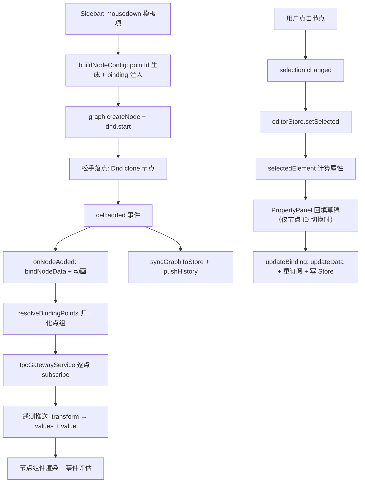

# roc-wes 画布编辑器开发流程

本文以「拖拽一个货架节点到画布 → 选中 → 属性面板编辑 → 数据绑定驱动渲染」为主线，
逐阶段拆解画布编辑器的初始化、事件链与数据流，帮助开发者快速建立全局心智模型。

涉及核心文件：

| 文件 | 职责 |
| --- | --- |
| `src/components/nodes/registry.ts` | 全部自定义 Vue 节点的形状注册（导入即注册，幂等） |
| `src/components/nodes/nodeTemplates.ts` | 节点模板注册表 + `buildNodeConfig()`（配置驱动拖拽建节点） |
| `src/components/X6Canvas.vue` | 画布核心：Graph 创建、插件、快捷键、路线、显示模式 |
| `src/composables/useGraphSync.ts` | 画布 ↔ Store 双向同步（防循环标志 + 事件监听 + watcher） |
| `src/composables/useDataService.ts` | 数据服务路由中心：节点订阅绑定 / 退订 / 遥测写入 |
| `src/components/Sidebar.vue` | 组件库侧边栏（模板分组展示 + mousedown 启动 Dnd） |
| `src/components/PropertyPanel.vue` | 属性面板（基础 / 数据绑定 / 路线 / 事件 四个标签页） |
| `src/stores/editor.ts` | 编辑器 Store：graphData、selectedId、历史记录 |

## 阶段一：初始化（页面加载时）

### 1.1 节点形状注册

`main.ts` 在应用启动前 import `components/nodes/registry`，模块加载即执行
`registerAllNodes()`：遍历 `nodeRegistry` 数组，逐一调用 `@antv/x6-vue-shape` 的
`register({ shape, component })`。之后 X6 渲染对应 `shape` 的节点时，自动使用该 Vue 组件渲染。

```ts
// main.ts
import './components/nodes/registry'   // 导入即注册，必须在使用画布前执行一次
```

> 新增节点组件：在 `registry.ts` 的 `nodeRegistry` 加一项（shape → 组件），
> 再在 `nodeTemplates.ts` 加一条模板配置即可，侧边栏与拖拽自动生效。

### 1.2 画布创建与插件安装

`X6Canvas.vue` 的 `onMounted` 中创建 `Graph` 实例，关键配置：

- 网格 / 背景（主题 CSS 变量驱动，切换主题时 `applyThemeToCanvas` 重绘）
- 右键平移（`panning.eventTypes: ['rightMouseDown']`）、滚轮缩放（0.2~3）、虚拟渲染
- `interacting`：路线持久路径与坐标标签覆盖层不可拖动/缩放

随后安装插件：`Selection`（框选，Shift 多选）、`Transform`（节点缩放）、
`Clipboard`、`Keyboard`、`History`（撤销/重做，`beforeAddCommand` 过滤运行态遥测、
动画帧与路线辅助图形，避免污染撤销栈），并绑定全套快捷键
（Ctrl+C/X/V/D/A/Z/S、Delete、方向键微调、Ctrl+=/-/0 缩放等）。

同时构造两个 composable（画布的"神经中枢"）：

```ts
useGraphSync({
  getGraph, onReload,
  onNodeAdded,    // 新增节点回调：数据绑定 + 动画 + 图标模式尺寸压缩
  onNodeRemoved,  // 移除节点回调：退订 + 释放点 ID + 清路线覆盖层
})
useDataService()  // 数据源创建缓存、节点订阅绑定与清理
```

### 1.3 ready 事件与布局装配

`X6Canvas` 通过 `emit('ready', { graph, dnd })` 通知父组件 `MainLayout.vue`，
父组件保存实例后才渲染 `Sidebar` 与 `PropertyPanel`（二者依赖 graph/dnd 实例）。

另有一条时序保障：`datasources.json` 是异步读取的，画布加载（`bindAllNodes`）
可能早于数据源就绪，导致订阅解析失败。`X6Canvas` 监听 `dataSourceStore.loaded`，
就绪后统一补绑一次（`bindNodeData` 幂等：先退订再订阅）。

## 阶段二：从 Sidebar 拖拽节点到画布

### 2.1 模板驱动的配置构建

侧边栏按分组（基础 / WCS 设备 / IoT 监控）渲染 `nodeTemplates`，
鼠标按下即启动拖拽：

```
Sidebar.vue → @mousedown="handleDragStart($event, item)"
            → buildNodeConfig(item, graph)      // nodeTemplates.ts
            → graph.createNode(nodeConfig)
            → dnd.start(node, e)
```

`buildNodeConfig` 统一处理（**不再有任何节点类型的 if-else 分支**）：

1. 尺寸与原生形状样式（`attrs` / `ports`，仅 rect/circle 使用）；
2. 若模板配置了 `pointIdTemplate`：`PointIdGenerator` 先扫描画布已用 ID，再生成唯一 pointId；
3. 构建 `data`：
   - `buildData(pointId)` 优先（复杂节点，如货架：transform 需闭包引用随机货格）；
   - 否则 `data` 静态对象深拷贝 / 函数形式返回全新对象（避免引用共享）；
4. 有 pointId 时自动注入绑定：`data.binding = { pointId, transform, transformSource }`
   （`transform` 为运行期函数，`transformSource` 为其源码字符串，供持久化）。

### 2.2 落点与 cell:added 事件链

`Dnd` 插件在松手处克隆节点放入画布（`getDropNode: node => node.clone()`），
触发 `cell:added`，由 `useGraphSync` 统一处理：

```
cell:added
  ├─ onNodeAdded(cell)                     // X6Canvas 提供的回调
  │    ├─ dataService.bindNodeData(cell)   // 有 binding.pointId 才订阅（未选数据源则静默）
  │    ├─ applyNodeAnimation(cell)         // 应用节点动画（如有）
  │    └─ 图标模式下按 iconSize 压缩尺寸
  ├─ syncGraphToStore()                    // serializeGraph(graph) → editorStore.setGraphData
  └─ editorStore.pushHistory()             // 推入撤销历史
```

`syncGraphToStore` 经 `utils/graphSerializer.serializeGraph` 把画布序列化为
`{ nodes, edges }` 写入 Store（节点/边按 id 排序归一）。

### 2.3 节点移除的对称清理

`cell:removed` 触发 `onNodeRemoved`：`unbindNodeData`（取消订阅）→
清除路线覆盖层 → `PointIdGenerator.release` 释放主点与全部附加点 ID。

## 阶段三：数据绑定与遥测驱动（运行期链路）

### 3.1 订阅建立

`useDataService.bindNodeData(cell)`：

1. `resolveBindingPoints(binding)` 归一化点组：优先 `points[]`（去重去空），
   旧单点格式回退为 `[{ pointId, transformSource }]`，首组为主点；
2. 按 `binding.sourceId` 解析数据源实例 → `getDataService` 路由：
   全部协议（演示 + 7 类真实模式）统一走 `IpcGatewayService`（Tauri IPC）；
3. 逐点 `subscribe`。**未选数据源（无 sourceId）的绑定不订阅，节点保持静态值**；
   未绑定数据源的节点不接收任何模拟数据。

### 3.2 遥测写入与事件评估

每次数据推送：该点组的转换函数（`transformSource` 经 `new Function` 编译）处理原始值 →
全部点写入 `node.data.values[pointId]`（`{ value, timestamp, quality }`）→
主点额外写入 `node.data.value`（附 `_timestamp` / `_quality`）驱动节点渲染 →
触发 `NodeEventService.evaluateNodeEvents`（事件规则评估，见开发指南 §5.5）。

> ⚠️ `value` / `values` / `_timestamp` / `_quality` 等是**运行期遥测字段**，
> 列于 `useGraphSync` 的 `RUNTIME_DATA_KEYS`：画布 ↔ Store 全量对比前会剥离这些字段，
> 否则高频遥测刷新会被误判为"实质变化"→ 整画布重建 → 数据回落旧快照（表现为数据丢失）。

## 阶段四：点击节点，选中触发属性面板

### 4.1 选中事件

`useGraphSync` 注册的 `selection:changed` 监听只做一件事——写选中 ID：

```ts
graph.on('selection:changed', ({ selected }) => {
  editorStore.setSelected(selected?.length ? selected[0].id : null)
})
graph.on('blank:click', () => editorStore.selectCanvas())  // 空白处 → 画布属性
```

### 4.2 Store 派生选中元素

`editorStore.selectedElement` 计算属性按 `selectedId` 在 `graphData.nodes` 中查找，
返回 `{ type: 'node', data }`（含 name、维度、pointId、binding 等设计数据）。
`PropertyPanel` 的 `element` 计算属性直接消费它。

## 阶段五：PropertyPanel 渲染与编辑

面板含四个标签页：**基础 / 数据绑定 / 路线 / 事件**，宽度可拖动（200~600px），支持折叠。

### 5.1 坐标与尺寸的独立管理

位置/尺寸不经 Store 响应式链，而是 `posX/posY/nodeWidth/nodeHeight` 独立 ref +
rAF 轮询直接从 X6 节点实例读取（`syncPositionFromCanvas` / `startPositionPolling`），
避免 deep watcher 引起响应式循环。编辑坐标则反向调用
`useGraphSync.updateNodePosition / updateNodeSize` 写回画布并同步 Store。

### 5.2 绑定草稿加载（只监听节点 ID）

```ts
watch(() => element.value?.data?.id, ...)   // 刻意不深监听 element
```

切换选中节点时回填草稿：`bindingSourceId`（数据源实例）+ `bindingGroups`
（点组列表：点 ID + 点名称 + 转换函数 + 备注成组，首组为主点固定不可删；
另支持「⇪ 导入点位（批量）」从 CSV / Excel（xlsx/xls）/ txt 文件导入或粘贴文本，解析见 `src/utils/pointImport.ts`，
粘贴文本分隔符自动探测（含 Tab 按 Tab，否则逗号）；Excel/CSV 经 xlsx 库解析行数据后转 Tab 分隔草稿，首行表头自动跳过，
CSV 编码自动探测 UTF-8/GBK（中文环境 Excel 另存为 CSV 默认 ANSI/GBK）；
可下载带表头的 CSV 模板（Excel 可直接打开），含逗号的 S7 地址经 CSV/Excel 导入天然安全；
导入方式二选一：追加（缺省，保留现有点位、重复跳过）或覆盖现有点组）。
Store 中无 binding 时兜底从 X6 节点实例直读，确保信息不丢。

> 为什么只监听 ID 而非深度监听：`updateBinding` 会把 binding 写回 Store，
> `selectedElement` 随之生成新对象；深度监听会在每次击键时把草稿回填一遍
> （未选数据源时 binding 为 undefined，草稿被清空 → 点 ID 无法输入）。

### 5.3 绑定提交（updateBinding）

点组变更/数据源切换即提交，规则：

- **有主点即提交**（`sourceId` 允许后补）：点位是用户录入的设计数据，
  若要求"主点 + 数据源同时具备"才写入，未选数据源时录入的点位会在切换节点时丢失；
  无 sourceId 的绑定运行期不订阅，节点保持静态值，语义安全；
- 写回 X6 节点必须用 `node.updateData({ binding })`（顶层整体替换，deep:false）——
  默认 `setData` 深合并（lodash.merge）数组按下标合并（删除点组会残留尾部旧项）
  且跳过 undefined（旧字段清不掉）；
- 先 `unbindNodeData` 取消旧订阅，绑定有效时再 `bindNodeData` 建立新订阅；
- 最后把 binding 写入 Store 的 `data.binding`（与画布结构一致，防重载覆盖）。

### 5.4 运行期数据流总结



## 关键设计要点

1. **配置驱动**：节点拖拽完全由 `nodeTemplates` 注册表驱动，侧边栏无节点类型分支；
   新增节点 = registry 加一项 + 模板加一条。
2. **Store 是设计数据的单一数据源**：属性面板读取来自 `editorStore.selectedElement`；
   运行期遥测字段只写画布节点，不进 Store 对比基线（`RUNTIME_DATA_KEYS`）。
3. **防循环标志**：画布与 Store 相互监听，`useGraphSync` 用
   `isUpdatingFromStore / isSyncingPosition / isSyncingSize / isResizing / isSyncSuppressed`
   分别拦截各类回环；批量操作（显示模式切换、路线重绘）期间用 `setSyncSuppressed` 抑制同步。
4. **整体替换语义字段用 updateData**：`binding` / `events` 等字段写回必须
   `node.updateData(...)`（deep:false），禁用默认深合并。
5. **转换函数持久化**：`transform` 是函数不可序列化，约定 `transformSource` 存
   自包含箭头函数源码（不引用外部变量），运行期 `new Function` 按需编译。
6. **订阅幂等与补绑**：`bindNodeData` 先退订再订阅；数据源 Store 异步就绪后
   `bindAllNodes` 统一补绑，规避画布加载与 `datasources.json` 读取的时序竞态。
7. **撤销栈卫生**：History 插件 `beforeAddCommand` 过滤运行态字段、动画帧
   （transform/opacity）与路线辅助图形；拖动用 startBatch/stopBatch 合并为一条记录。

## 延伸阅读

- 环境搭建与日常命令、协议扩展指南：[开发指南](./开发指南.md)
- 桌面数据链路与 Rust 网关架构：[Tauri 目标架构](./tauri-目标架构.md)
- 各数据源协议的实现细节：[数据源手册](../数据源手册/roc-wes%20数据源手册.md)
