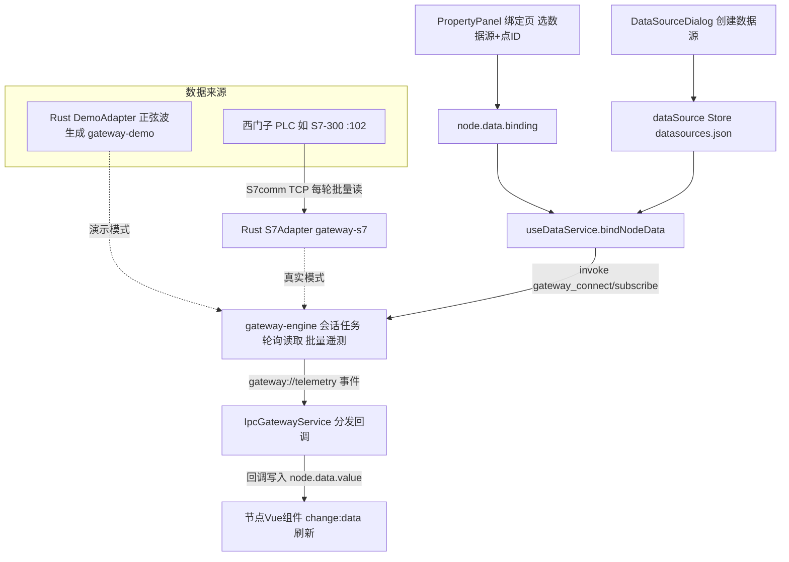

# S7 数据源工作流程（演示模式 + 真实模式）

下面结合实例代码，从"数据从哪来 → 数据源注册 → 节点绑定 → 数据流动"完整讲一遍西门子 S7 数据源的流程。两种模式走**同一条 IPC 链路**：

- **演示模式**：数据由桌面端 Rust `DemoAdapter` 内置生成（正弦波，无 PLC、无网络连接）；
- **真实模式**：数据来自真实 PLC，Rust 网关的 `S7Adapter` 通过 S7comm 协议（TCP :102）按周期批量读取（WebView 不直连）。

## 一个完整例子

### 演示模式：数字标签绑定内置模拟数据

1. 数据源管理新建西门子 S7 演示数据源 → 无需地址（`config.demo = true` 标识）

2. 属性面板选该数据源、点ID 填 `DB1,REAL0`（真实格式即可，演示模式原样接受）

3. 前端 `invoke('gateway_subscribe', { pointId: 'DB1,REAL0' })`

4. Rust 会话每秒调 `DemoAdapter.read()`，经 `gateway://telemetry` 推回 `{pointId:'DB1,REAL0', value:63.4, ...}`

5. 回调写入 `node.data.value = 63.4` → 数字标签每秒跳动一次

6. 若配置了转换函数 `(raw) => Math.round(raw)`，显示前会先取整

7. 若事件规则设了 `value > 75 告警`，正弦波升过 75 时触发上升沿告警

### 真实模式：绑定真实 PLC（或模拟器联调）

1. 数据源管理新建「堆垛机1号PLC」→ 连接模式选 **真实设备**，在下方连接配置区的地址栏填 `192.168.1.20`（rack 0 / slot 2）

2. 属性面板选该数据源、点ID 填 `DB1,REAL0`

3. Rust 网关的 `S7Adapter` 连接 `192.168.1.20:102` 并完成 S7 握手（TPKT/COTP/S7 setup）

4. 会话任务每秒按订阅点集构造 `MultiReadItem` 批量读 PLC，读到的值经 `gateway://telemetry` 事件推回前端

5. 回调写入 `node.data.value` → 数字标签每秒刷新 PLC 实时值

6. 无真机时可用项目自带的集成测试联调协议链路：`cargo test -p gateway-s7`（snap7-server 进程内 PLC 模拟器跑真实 S7 帧往返）


## 整体链路

两种模式仅「数据从哪来」一段不同（演示：DemoAdapter 内置生成；真实：PLC 经 S7Adapter 轮询读取），其余链路完全一致：




## ① 数据从哪来

### 演示模式：内置模拟引擎（桌面端 Rust，无连接）

[gateway-demo/src/lib.rs](file://C:/myf/project/allinone/roc-wes/src-tauri/crates/gateway-demo/src/lib.rs) 的 `DemoAdapter`（未选波形时缺省正弦）实现 `DeviceAdapter`，由 gateway-engine 会话任务按轮询周期调用 `read()` 生成一批遥测：

```rust
// Rust 侧：按点位 ID 生成正弦波 + 确定性伪噪声（约 20~80）
fn sine_value(point_id: &str, now_ms: u64) -> f64 {
    let phase = (hash_u64(point_id) % 628) as f64 / 100.0;   // 0~2π，错开各点波形
    let noise = (pseudo_noise(point_id, now_ms) - 0.5) * 2.0; // ±1
    round1(50.0 + 30.0 * (now_ms as f64 / 5000.0 + phase).sin() + noise)
}
```

不同 pointId 的相位由哈希派生错开，多个仪表的曲线不会重叠；数据经 `gateway://telemetry` 事件批量推给前端（每轮询一次推一批，减少 IPC 开销）。演示模式接受任意点 ID（含 `DB1,REAL0` 这类真实 S7 地址格式）。

### 真实模式：西门子 PLC（S7comm 轮询读）

S7 是**轮询读协议**：PLC 不主动推送，`S7Adapter` 每轮按订阅点集构造 `MultiReadItem` 列表一次批量读（库内自动 PDU 分批）；批量失败时降级逐点读以隔离单点故障，首点仍失败视为连接级故障触发引擎重连。数值一律大端序解码（REAL/INT/WORD/DINT/DWORD/BYTE/位）。


## ② 数据源注册（配置层）

用户在「数据源管理」对话框新建数据源（[dataSource.ts](file://C:/myf/project/allinone/roc-wes/src/stores/dataSource.ts)）。类型下拉与连接配置均由注册表驱动（[protocolConfigRegistry.ts](file://C:/myf/project/allinone/roc-wes/src/components/dataSource/protocolConfigRegistry.ts)）：选西门子 S7 + 真实设备模式时渲染 `S7ProtocolConfig.vue` 子组件，在其地址栏填写 PLC 地址（主机[:端口]，缺省端口 102），并可配置机架号/槽号/轮询间隔；演示模式不显示连接配置区，保存时 `config.demo` 置为 `true`。

是否为演示模式由 [isDemoSource](file://C:/myf/project/allinone/roc-wes/src/platform/deviceConfig.ts) 判定：仅以 `config.demo === true` 为准（演示模式地址可为空）。两种模式保存后均落盘到 `datasources.json`：

```json
{ "id": "ds-1712345-abc123", "name": "内置S7模拟源", "type": "s7", "url": "", "config": { "demo": true } }
```

```json
{ "id": "ds-1712345-def456", "name": "堆垛机1号PLC", "type": "s7", "url": "192.168.1.20", "config": { "demo": false, "rack": 0, "slot": 2, "pollInterval": 1000 } }
```

前者判定为演示模式（映射配置 `{ protocol:'s7', host:'', port:102, rack:0, slot:2, isMock:true, pollIntervalMs }`，缺省正弦；若用户选了「演示波形」则额外带 `profile`）；后者为真实模式（映射配置 `{ protocol:'s7', host:'192.168.1.20', port:102, rack:0, slot:2, pollIntervalMs }`），均交 Rust 网关接管。


## ③ 节点绑定（PropertyPanel）

属性面板「数据绑定」页选择该数据源 + 填写点ID（如 `DB1,REAL0`，可「＋ 添加点组」继续加附加点，或「⇪ 导入点位」从 CSV / Excel（xlsx/xls）/ txt 文件批量导入——S7 地址含逗号，建议用 CSV/Excel 或 Tab 分隔文本）后，`updateBinding` 把配置写入节点并触发订阅（两种模式完全一致）。

> **多 DB 块**：S7 点 ID 是自描述完整地址，各点 ID 各写各的 DB 号即可（如 `DB30,REAL0` 与 `DB7,DINT6` 混绑），网关 `read_multi_vars` 单次 PDU 跨 DB 批量读，无需任何额外配置。S7 源下点 ID **不允许手输**，一律经地址生成助手产生（点 ID 行点击或 `⌗` 按钮打开：数据区 DB/M/I/Q + 类型 + 偏移 + 位号实时预览拼出合法地址，现有点 ID 自动反解析回填），保证地址与 Rust `parse_point` 语法严格一致；点组按 DB 块自动分 tab 展示（主点所在 tab 固定第一并带「主」徽标，M/I/Q 区点位归「其他点位」tab）；批量导入同样逐行严格校验，非法地址跳过并计数报告。实现见 [s7Address.ts](file://C:/myf/project/allinone/roc-wes/src/utils/s7Address.ts)。

```ts
// 有主点即提交绑定，sourceId 允许后补（无 sourceId 的绑定运行期不订阅，节点保持静态值）
if (primary) {
  binding = {
    points: validGroups,                         // 全部点组：点ID + 点名称 + 转换函数 + 备注成组，首组为主点
    sourceId: bindingSourceId.value || undefined,
  }
}
node.updateData({ binding })   // 写 X6 节点：须顶层整体替换（深合并会导致点组删除残留）
editorStore.updateNode(nodeId, { data: { ...(storeNode.data || {}), binding } })  // 写 Store 持久化
props.canvasRef.unbindNodeData(nodeId)            // 先退订旧点
if (binding) props.canvasRef.bindNodeData(node)   // 重建订阅
```


## ④ 服务调度（useDataService，总调度）

[useDataService.ts](file://C:/myf/project/allinone/roc-wes/src/composables/useDataService.ts) 是绑定逻辑的核心，所有数据源（全部协议演示/真实模式）一律路由到 `IpcGatewayService`，`bindNodeData` 做三件事：

```ts
// 1. 按 sourceId 从 Store 解析出数据源实例
const ds = dataSourceStore.getDataSource(binding.sourceId)
sourceType = ds.type   // 's7'

// 2. 统一路由：演示模式映射为 { protocol:'s7', host:'', port:102, rack:0, slot:2, isMock:true, pollIntervalMs }（缺省正弦，选了波形才带 profile），
//    真实模式映射为 { protocol:'s7', host, port, rack, slot, pollIntervalMs }
service = new IpcGatewayService(key, buildDeviceConfig(sourceType, sourceUrl, sourceConfig), 'S7')

// 3. 按点组逐点订阅，回调里把值写入节点（每点用自己组内的转换函数）
for (const p of resolveBindingPoints(binding)) {
  service.subscribe(p.pointId, (point) => {
    const converted = transform ? transform(point.value) : point.value
    // 全部点写入 data.values[pointId]；主点额外写入 data.value / _timestamp / _quality 驱动渲染
    node.setData(nextData)
    evaluateNodeEvents(node.id, currentData, nextData)  // 触发事件规则（如越限告警）
  })
}
```

**关键设计**：10 个节点绑同一个数据源，只会创建 **1 个** IPC 会话（`dataServiceMap` 按 `类型:URL:配置` 缓存、单条 PLC 连接），各自订阅不同的 pointId（同一轮批量读取）；未绑定数据源（无 sourceId）的节点不订阅，保持静态值。


## ⑤ 连接与订阅分发（IpcGatewayService → Rust）

[IpcGatewayService.ts](file://C:/myf/project/allinone/roc-wes/src/services/IpcGatewayService.ts) 实现统一的 `IDataService` 接口，底层为 Tauri IPC（所有数据源的唯一通道）。两种模式仅 `gateway_connect` 的 config 不同：

```ts
// 建会话：演示模式用 DemoAdapter，真实模式用 S7Adapter（S7comm TCP 直连 PLC）
await invoke('gateway_connect', { deviceId, config: { protocol: 's7', host: '', port: 102, rack: 0, slot: 2, isMock: true, pollIntervalMs: 1000 } })
await invoke('gateway_connect', { deviceId, config: { protocol: 's7', host: '192.168.1.20', port: 102, rack: 0, slot: 2, pollIntervalMs: 1000 } })

// 订阅：登记回调 + 通知 Rust（连接建立前的订阅会补发；S7 为轮询读协议，
// 订阅点集只决定每轮 read() 读哪些点，PLC 侧无订阅帧）
await invoke('gateway_subscribe', { deviceId, pointId })

// 接收遥测：批量事件按 pointId 分发给该点的所有回调
listen('gateway://telemetry', (e) => {
  for (const p of e.payload.points) { /* 分发给 callbacks.get(p.pointId) */ }
})
```

真实模式下 Rust 侧 `gateway-s7/src/lib.rs` 的 `S7Adapter` 接管读取：`connect()` 域名解析后按 rack/slot 建连（超时 5s），`read()` 每轮批量读（失败降级逐点、首点失败触发重连），大端解码后按点位顺序输出。


## ⑥ 点 ID 约定（nodes7 风格地址字符串）

真实模式下点ID必须与 PLC 程序中实际存在的地址对应，非法地址被跳过（不影响其他点）：

| 数据区 | 语法 | 示例 |
| --- | --- | --- |
| DB 标量 | `DB{n},{类型}{偏移}` | `DB1,REAL0` / `DB1,INT4` / `DB1,WORD6` |
| DB 位 | `DB{n},X{字节}.{位}`（X 可省略） | `DB1,X0.0` / `DB1,332.0` |
| M 区 | `MB/MW/MD{偏移}`、位 `M{字节}.{位}` | `MB0` / `M10.3` |
| I / Q 区 | `IB/IW/ID{n}` / `QB/QW/QD{n}` | `IB0` / `QW2` |

类型关键字：REAL/LREAL/INT/WORD/DINT/DWORD/BYTE(B)，大小写不敏感；`DB1,REAL0,1`（三逗号）与数组点（`DB1,REAL0.4`，v2 规划）当前不支持。


## ⑦ 数据到达节点 UI

`node.setData()` 触发 X6 的 `change:data` 事件，节点 Vue 组件通过 [useNodeData.ts](file://C:/myf/project/allinone/roc-wes/src/composables/useNodeData.ts) 声明的响应式 ref 自动刷新：

```ts
const { value } = useNodeData(props.node, { value: 0 })  // 模板里 {{ value }} 实时跳动
```


## ⑧ 重连与生命周期清理

- **断线重连**：真实模式下 PLC 断开（或网络中断）后，网关引擎指数退避自动重连（2s→30s）；重连成功后按当前订阅点集恢复轮询读取，无需手动干预
- 改绑定点ID：`unbindNodeData(nodeId)` 先退订再重建订阅（S7 侧仅变更每轮读取的点集，无 PLC 帧交互）
- 画布重载：`unbindAllNodes()` 只退订**不断会话**（会话可复用）
- 组件卸载：`dispose()` 退订 + `disconnect()` 销毁全部 IPC 会话（应用退出时 Rust 侧也会统一 shutdown）


## 演示模式 ↔ 真实模式切换

| | 演示模式 | 真实模式 |
| --- | --- | --- |
| 数据从哪来 | Rust `DemoAdapter` 内置生成正弦波 | 真实 PLC（S7comm 每轮批量读） |
| 适配器 | Rust `DemoAdapter`（无连接） | Rust `S7Adapter` 作为 S7comm 客户端连接 PLC |
| 前端通道 | Tauri IPC（`gateway_connect`/`gateway_subscribe`） | 相同（同一条 IPC 链路） |
| 是否需要 PLC/网络 | 不需要 | 需要（TCP 102，rack/slot 正确） |

切换时只需把数据源改为对应连接模式并填写地址与 rack/slot，节点绑定与前端代码零改动；两种模式数据延迟均 ≤ pollIntervalMs。
