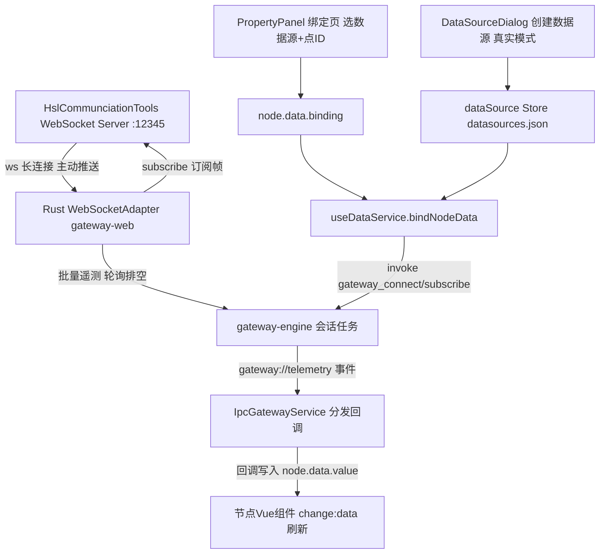

下面结合实例，从"HslCommunication 测试工具（外部 WS 服务） → 数据源注册 → 节点绑定 → 数据流动"完整讲一遍 **真实模式** WebSocket 数据源的工作流程。

> 与《内置 WebSocket 数据源的流程》的区别：演示模式的数据由桌面端 Rust `DemoAdapter` 内置生成（无端口）；真实模式则由外部 WebSocket 服务推送数据，由 Rust 网关的 `WebSocketAdapter` 作为 WS 客户端连接服务地址（WebView 不直连，与演示模式同一条 IPC 链路）。

## 一个完整例子

仪表盘节点绑定 HslCommunication 测试工具提供的 WebSocket 服务：

1. 打开 **HslCommunciationTools**（HslCommunication 工业联调工具），创建 WebSocket Server 并启动监听 `ws://127.0.0.1:12345`

   <!-- 截图保存为本目录下的 hsl-websocket-server.png -->
   

2. 数据源管理新建「WebSocket测试数据源」→ 连接模式选 **真实模式**，地址填 `ws://127.0.0.1:12345`

3. 属性面板选该数据源、点ID 填 `sensor.temp.001`

4. Rust 网关的 `WebSocketAdapter` 连接 `ws://127.0.0.1:12345`；连接成功后自动发送 `{"action":"subscribe","topic":"sensor.temp.001"}`（Hsl 工具「接收」区可以看到这条订阅帧）

5. 在 Hsl 工具「指令」框填入数据帧 `{"topic":"sensor.temp.001","value":63.4}`，点「发送给选中客户机/广播给全部客户机」推给网关，经 `gateway://telemetry` 事件推回前端

6. 回调写入 `node.data.value = 63.4` → 仪表盘数值立即刷新

7. 若配置了转换函数 `(raw) => Math.round(raw)`，显示前会先取整

8. 若事件规则设了 `value > 75 告警`，推送值超过 75 时触发上升沿告警

> 图中「指令」框里的 `{"action":"start_demo","count":20}` 是自定义业务指令的示例：roc-wes 只消费含 `topic`/`id`/`pointId` 且主题匹配的数据帧，其余指令帧会被安全忽略，不影响正常订阅。


## 整体链路




## ① 启动 HslCommunication WebSocket Server（外部服务）

HslCommunciationTools 是 HslCommunication 库配套的工业联调测试工具，可以一键创建 WebSocket 服务端，用于在没有真实设备时模拟服务端推送：

1. 打开 HslCommunciationTools，切换到 **WebSocket** 页签；
2. 设置监听地址 `ws://127.0.0.1:12345`，点击启动监听（状态显示「服务器已启动」）；
3. roc-wes 客户端连上后，「客户端」区会出现连接条目（如 `::127.0.0.1[63349]`），「接收」区可以看到客户端发来的订阅帧；
4. 「指令」框用于**服务端 → 客户端**方向发消息：输入数据帧后选择「发送给选中客户机」或「广播给全部客户机」即可模拟推送。

工具本身不实现订阅语义（收到 `subscribe` 帧不会自动产生数据），数据帧需要手动发送或配合工具的场景脚本发送——这正好用来验证前端对任意推送格式的解析兼容性。


## ② 数据源注册（配置层，真实模式）

用户在「数据源管理」对话框新建数据源（[dataSource.ts](file://C:/myf/project/allinone/roc-wes/src/stores/dataSource.ts)）：

- 名称：`WebSocket测试数据源`
- 类型：`WebSocket`
- 连接模式：**真实模式**
- 地址：`ws://127.0.0.1:12345`

保存后得到一个实例并落盘到 `datasources.json`：

```json
{ "id": "ds-1712345-abc123", "name": "WebSocket测试数据源", "type": "websocket", "url": "ws://127.0.0.1:12345" }
```

是否为演示模式由 [isDemoSource](file://C:/myf/project/allinone/roc-wes/src/platform/deviceConfig.ts) 判定：显式 `config.demo` 优先，其次地址等于内置演示标识地址（`ws://localhost:8080/ws`）才视为演示。本例两者都不满足 → **真实模式**，配置映射为 `{ kind:'websocket', url, pollIntervalMs }` 交 Rust 网关接管。


## ③ 节点绑定（PropertyPanel）

属性面板「数据绑定」页选择该数据源 + 填写点ID（如 `sensor.temp.001`）后，`updateBinding` 把配置写入节点并触发订阅：

```ts
// 必须同时具备点ID与数据源实例才启用绑定
if (pointId && bindingSourceId.value) {
  binding = { pointId, sourceId: bindingSourceId.value }
}
node.setData({ ...currentData, binding })   // 写 X6 节点
editorStore.updateNode(nodeId, { data: { ...(storeNode.data || {}), binding } })  // 写 Store 持久化
if (binding && props.canvasRef.bindNodeData) props.canvasRef.bindNodeData(node)   // 建立订阅
```


## ④ 服务调度（useDataService，总调度）

[useDataService.ts](file://C:/myf/project/allinone/roc-wes/src/composables/useDataService.ts) 的 `getDataService` 统一路由——真实模式 WebSocket 同样走 IPC，由 Rust 网关建连：

```ts
// 所有数据源（演示/真实/工业协议）一律经 Rust 原生网关
// 本例映射为 { kind:'websocket', url:'ws://127.0.0.1:12345', pollIntervalMs:1000 }
const service = new IpcGatewayService(key, buildDeviceConfig(sourceType, sourceUrl, sourceConfig), 'WEBSOCKET')
```

**关键设计**：多个节点绑同一个数据源，只会创建 **1 个** IPC 会话（`dataServiceMap` 按 `类型:URL:配置` 缓存），各自订阅不同的 pointId。


## ⑤ 连接与订阅（IpcGatewayService → Rust WebSocketAdapter）

[IpcGatewayService.ts](file://C:/myf/project/allinone/roc-wes/src/services/IpcGatewayService.ts) 经 Tauri IPC 建会话，Rust 侧 `gateway-web/src/websocket.rs` 的 `WebSocketAdapter` 作为 WS 客户端连接服务并接管订阅/解析：

```ts
// 建会话：请求 Rust 创建 WebSocket 适配器并启动轮询任务
await invoke('gateway_connect', { deviceId, config: { kind: 'websocket', url: 'ws://127.0.0.1:12345', pollIntervalMs: 1000 } })

// 订阅：登记回调 + 通知 Rust（网关每 tick 差量同步，向服务端发 subscribe 帧；Hsl 工具「接收」区可见）
await invoke('gateway_subscribe', { deviceId, pointId })

// 接收遥测：适配器解析数据帧（兼容 topic/id/pointId 任一字段标识点位，value/data 任一字段取值），
// 经 gateway://telemetry 事件批量推回，按 pointId 分发给回调
listen('gateway://telemetry', (e) => {
  for (const p of e.payload.points) { /* 分发给 callbacks.get(p.pointId) */ }
})
```

订阅回调里完成「转换 → 写节点 → 事件评估」：

```ts
service.subscribe(binding.pointId, (point) => {
  const newValue = transform ? transform(point.value) : point.value  // 可选转换函数
  node.setData({ ...currentData, value: newValue, _timestamp: point.timestamp, _quality: point.quality })
  evaluateNodeEvents(node.id, currentData, nextData)  // 触发事件规则（如越限告警）
})
```


## ⑥ 用 Hsl 工具模拟服务端推送

Hsl 工具里向客户端发送如下 JSON 帧，节点即会刷新：

```json
{ "topic": "sensor.temp.001", "value": 63.4, "timestamp": 1730000000000, "quality": "good" }
```

- `timestamp`（毫秒）与 `quality` 可省略，省略时分别取当前时间与 `good`；
- 点ID字段三选一：`topic` / `id` / `pointId`；数值字段二选一：`value` / `data`；
- 「客户端」区先选中目标连接再点「发送给选中客户机」，或直接「广播给全部客户机」；
- 修改 `value` 反复发送，即可观察节点数值跟随变化、转换函数与事件规则的效果。


## ⑦ 数据到达节点 UI

`node.setData()` 触发 X6 的 `change:data` 事件，节点 Vue 组件通过 [useNodeData.ts](file://C:/myf/project/allinone/roc-wes/src/composables/useNodeData.ts) 声明的响应式 ref 自动刷新：

```ts
const { value } = useNodeData(props.node, { value: 0 })  // 模板里 {{ value }} 实时跳动
```


## ⑧ 自动重连与生命周期清理

- **断线重连**：Hsl 工具停止监听（或网络中断）后，网关引擎指数退避自动重连（2s→30s）；重连成功后按当前订阅集重新下发订阅帧，无需手动干预；
- 改绑定点ID：`unbindNodeData(nodeId)` 先退订（网关向服务端发 `unsubscribe` 帧）再重建订阅；
- 画布重载：`unbindAllNodes()` 只退订**不断会话**（会话可复用）；
- 组件卸载：`dispose()` 退订 + `disconnect()` 销毁 IPC 会话（应用退出时 Rust 侧也会统一 shutdown）。


## 演示模式 ↔ 真实模式切换

| | 演示模式 | 真实模式（本文） |
| --- | --- | --- |
| 数据从哪来 | Rust `DemoAdapter` 内置生成正弦波 | 外部服务（如 Hsl 工具）推送 |
| 适配器 | Rust `DemoAdapter`（无端口） | Rust `WebSocketAdapter` 作为 WS 客户端连接外部服务 |
| 前端通道 | Tauri IPC（`gateway_connect`/`gateway_subscribe`） | 相同（同一条 IPC 链路） |
| 是否需要外部端口 | 不需要 | 需要（如 `:12345`） |

切换时只需把数据源改为对应连接模式并修改地址，节点绑定与前端代码零改动；两种模式数据延迟均 ≤ pollIntervalMs。
