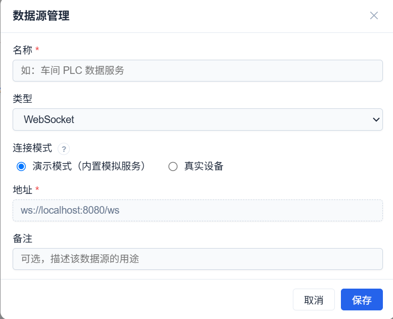
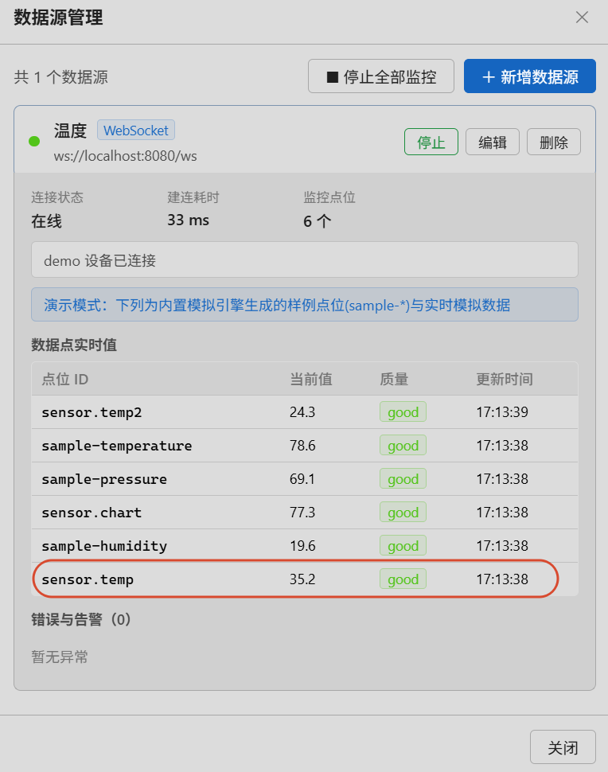
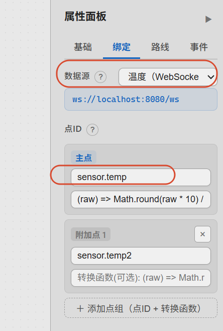
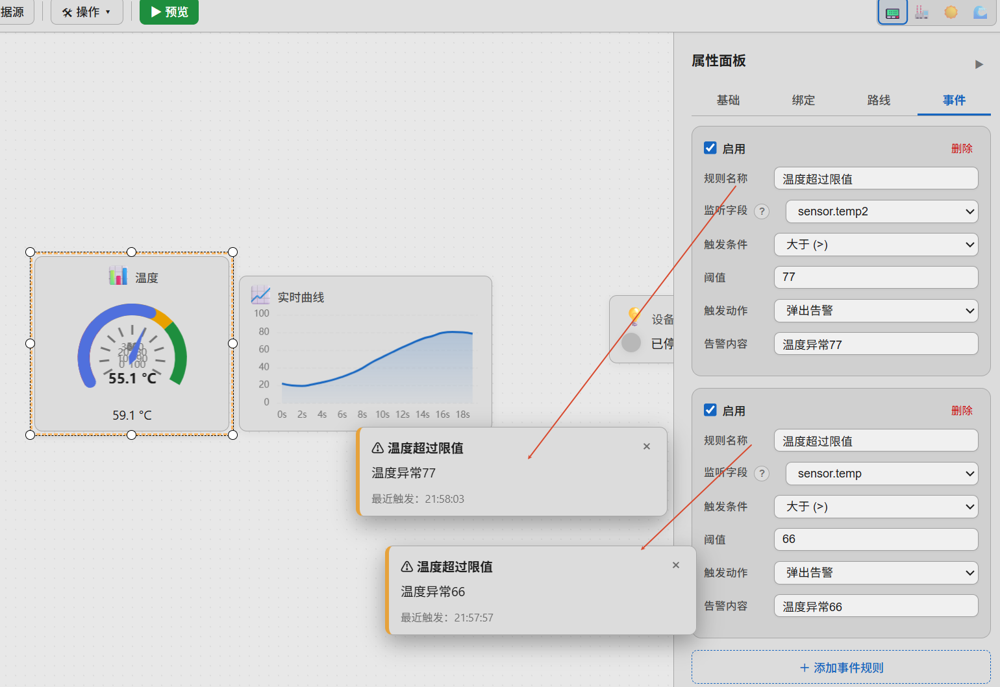
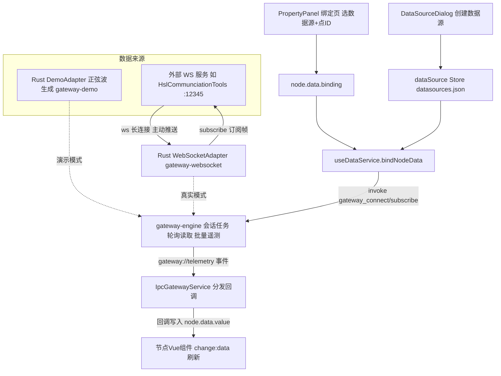

# WebSocket 数据源工作流程（演示模式 + 真实模式）

下面结合实例代码，从"数据从哪来 → 数据源注册 → 节点绑定 → 数据流动"完整讲一遍 WebSocket 数据源的流程。两种模式走**同一条 IPC 链路**：

- **演示模式**：数据由桌面端 Rust `DemoAdapter` 内置生成（正弦波，无端口、无外部服务）；
- **真实模式**：数据由外部 WebSocket 服务推送，Rust 网关的 `WebSocketAdapter` 作为 WS 客户端连接服务地址（WebView 不直连）。

## 一个完整例子

### 演示模式：仪表盘绑定内置模拟数据

1. 数据源管理新建 WebSocket 演示数据源 → 无需地址（`config.demo = true` 标识）





2. 属性面板选该数据源、点ID 填 `sensor.temp`



3. 前端 `invoke('gateway_subscribe', { pointId: 'sensor.temp.001' })`

4. Rust 会话每秒调 `DemoAdapter.read()`，经 `gateway://telemetry` 推回 `{pointId:'sensor.temp.001', value:63.4, ...}`

5. 回调写入 `node.data.value = 63.4` → 仪表盘指针每秒跳动一次

6. 若配置了转换函数 `(raw) => Math.round(raw)`，显示前会先取整

7. 若事件规则设了 `value > 75 告警`，正弦波升过 75 时触发上升沿告警



### 真实模式：仪表盘绑定 HslCommunication 测试工具

1. 打开 **HslCommunciationTools**（HslCommunication 工业联调工具），切换到 **WebSocket** 页签，设置监听地址 `ws://127.0.0.1:12345` 并启动监听（状态显示「服务器已启动」）

2. 数据源管理新建「WebSocket测试数据源」→ 连接模式选 **真实模式**，在下方连接配置区的地址栏填 `ws://127.0.0.1:12345`

3. 属性面板选该数据源、点ID 填 `sensor.temp.001`

4. Rust 网关的 `WebSocketAdapter` 连接 `ws://127.0.0.1:12345`；连接成功后自动发送 `{"action":"subscribe","topic":"sensor.temp.001"}`（Hsl 工具「接收」区可以看到这条订阅帧）

5. 在 Hsl 工具「指令」框填入数据帧 `{"topic":"sensor.temp.001","value":63.4}`，点「发送给选中客户机/广播给全部客户机」推给网关，经 `gateway://telemetry` 事件推回前端

6. 回调写入 `node.data.value = 63.4` → 仪表盘数值立即刷新

7. 若配置了转换函数 `(raw) => Math.round(raw)`，显示前会先取整

8. 若事件规则设了 `value > 75 告警`，推送值超过 75 时触发上升沿告警

> 图中「指令」框里的 `{"action":"start_demo","count":20}` 是自定义业务指令的示例：roc-wes 只消费含 `topic`/`id`/`pointId` 且主题匹配的数据帧，其余指令帧会被安全忽略，不影响正常订阅。


## 整体链路

两种模式仅「数据从哪来」一段不同（演示：DemoAdapter 内置生成；真实：外部服务经 WebSocketAdapter 接入），其余链路完全一致：




## ① 数据从哪来

### 演示模式：内置模拟引擎（桌面端 Rust，无端口）

[gateway-demo/src/lib.rs](file://C:/myf/project/allinone/roc-wes/src-tauri/crates/gateway-demo/src/lib.rs) 的 `DemoAdapter`（`profile = Websocket`）实现 `DeviceAdapter` 端口，由 gateway-engine 会话任务按轮询周期调用 `read()` 生成一批遥测：

```rust
// Rust 侧：按点位 ID 生成正弦波 + 确定性伪噪声（约 20~80）
fn sine_value(point_id: &str, now_ms: u64) -> f64 {
    let phase = (hash_u64(point_id) % 628) as f64 / 100.0;   // 0~2π，错开各点波形
    let noise = (pseudo_noise(point_id, now_ms) - 0.5) * 2.0; // ±1
    round1(50.0 + 30.0 * (now_ms as f64 / 5000.0 + phase).sin() + noise)
}
```

不同 pointId 的相位由哈希派生错开，多个仪表的曲线不会重叠；数据经 `gateway://telemetry` 事件批量推给前端（每轮询一次推一批，减少 IPC 开销）。

### 真实模式：外部 WS 服务（以 HslCommunciationTools 为例）

HslCommunciationTools 是 HslCommunication 库配套的工业联调测试工具，可以一键创建 WebSocket 服务端，用于在没有真实设备时模拟服务端推送：

1. 打开 HslCommunciationTools，切换到 **WebSocket** 页签；
2. 设置监听地址 `ws://127.0.0.1:12345`，点击启动监听；
3. roc-wes 的网关适配器连上后，「客户端」区会出现连接条目（如 `::127.0.0.1[63349]`），「接收」区可以看到网关发来的订阅帧；
4. 「指令」框用于**服务端 → 客户端**方向发消息：输入数据帧后选择「发送给选中客户机」或「广播给全部客户机」即可模拟推送。

工具本身不实现订阅语义（收到 `subscribe` 帧不会自动产生数据），数据帧需要手动发送或配合工具的场景脚本发送——这正好用来验证网关对任意推送格式的解析兼容性。生产环境换成任意遵循同一帧协议的 WS 服务即可。


## ② 数据源注册（配置层）

用户在「数据源管理」对话框新建数据源（[dataSource.ts](file://C:/myf/project/allinone/roc-wes/src/stores/dataSource.ts)）。类型下拉与连接配置均由注册表驱动（[protocolConfigRegistry.ts](file://C:/myf/project/allinone/roc-wes/src/components/dataSource/protocolConfigRegistry.ts)）：选 WebSocket + 真实设备模式时渲染 `WebsocketProtocolConfig.vue` 子组件，在其地址栏填写服务地址；演示模式不显示地址栏，保存时 `config.demo` 置为 `true`。

是否为演示模式由 [isDemoSource](file://C:/myf/project/allinone/roc-wes/src/platform/deviceConfig.ts) 判定：仅以 `config.demo === true` 为准（演示模式地址可为空）。两种模式保存后均落盘到 `datasources.json`：

```json
{ "id": "ds-1712345-abc123", "name": "车间遥测", "type": "websocket", "url": "", "config": { "demo": true } }
```

```json
{ "id": "ds-1712345-def456", "name": "WebSocket测试数据源", "type": "websocket", "url": "ws://127.0.0.1:12345", "config": { "demo": false } }
```

前者判定为演示模式（映射配置 `{ protocol:'websocket', isMock:true, pollIntervalMs }`，缺省正弦；若用户选了「演示波形」则额外带 `profile`）；后者为真实模式（映射配置 `{ protocol:'websocket', url, pollIntervalMs }`），均交 Rust 网关接管。


## ③ 节点绑定（PropertyPanel）

属性面板「数据绑定」页选择该数据源 + 填写点ID（如 `sensor.temp.001`，可「＋ 添加点组」继续加附加点，或「⇪ 导入点位」从 CSV / Excel（xlsx/xls）/ txt 文件批量导入）后，`updateBinding` 把配置写入节点并触发订阅（两种模式完全一致）：

```ts
// 有主点即提交绑定，sourceId 允许后补（无 sourceId 的绑定运行期不订阅，节点保持静态值）
if (primary) {
  binding = {
    points: validGroups,                         // 全部点组：点ID + 点名称 + 转换函数 + 备注成组，首组为主点
    sourceId: bindingSourceId.value || undefined,
  }
}
node.updateData({ binding })   // 写 X6 节点：须顶层整体替换（深合并会导致点组删除残留）
editorStore.updateNode(nodeId, { data: { ...(storeNode.data || {}), binding } })  // 写 Store 持久化
props.canvasRef.unbindNodeData(nodeId)            // 先退订旧点
if (binding) props.canvasRef.bindNodeData(node)   // 重建订阅
```


## ④ 服务调度（useDataService，总调度）

[useDataService.ts](file://C:/myf/project/allinone/roc-wes/src/composables/useDataService.ts) 是绑定逻辑的核心，所有数据源（全部协议演示/真实模式）一律路由到 `IpcGatewayService`，`bindNodeData` 做三件事：

```ts
// 1. 按 sourceId 从 Store 解析出数据源实例
const ds = dataSourceStore.getDataSource(binding.sourceId)
sourceType = ds.type   // 'websocket'

// 2. 统一路由：演示模式映射为 { protocol:'websocket', isMock:true, pollIntervalMs }（缺省正弦，选了波形才带 profile），
//    真实模式映射为 { protocol:'websocket', url, pollIntervalMs }
service = new IpcGatewayService(key, buildDeviceConfig(sourceType, sourceUrl, sourceConfig), 'WEBSOCKET')

// 3. 按点组逐点订阅，回调里把值写入节点（每点用自己组内的转换函数）
for (const p of resolveBindingPoints(binding)) {
  service.subscribe(p.pointId, (point) => {
    const converted = transform ? transform(point.value) : point.value
    // 全部点写入 data.values[pointId]；主点额外写入 data.value / _timestamp / _quality 驱动渲染
    node.setData(nextData)
    evaluateNodeEvents(node.id, currentData, nextData)  // 触发事件规则（如越限告警）
  })
}
```

**关键设计**：10 个节点绑同一个数据源，只会创建 **1 个** IPC 会话（`dataServiceMap` 按 `类型:URL:配置` 缓存），各自订阅不同的 pointId；未绑定数据源（无 sourceId）的节点不订阅，保持静态值。


## ⑤ 连接与订阅分发（IpcGatewayService → Rust）

[IpcGatewayService.ts](file://C:/myf/project/allinone/roc-wes/src/services/IpcGatewayService.ts) 实现统一的 `IDataService` 接口，底层为 Tauri IPC（所有数据源的唯一通道）。两种模式仅 `gateway_connect` 的 config 不同：

```ts
// 建会话：演示模式用 DemoAdapter，真实模式用 WebSocketAdapter（作为 WS 客户端连接外部服务）
await invoke('gateway_connect', { deviceId, config: { protocol: 'websocket', isMock: true, pollIntervalMs: 1000 } })
await invoke('gateway_connect', { deviceId, config: { protocol: 'websocket', url: 'ws://127.0.0.1:12345', pollIntervalMs: 1000 } })

// 订阅：登记回调 + 通知 Rust（连接建立前的订阅会补发；真实模式下网关每 tick 差量同步，
// 向服务端发 subscribe 帧，Hsl 工具「接收」区可见）
await invoke('gateway_subscribe', { deviceId, pointId })

// 接收遥测：批量事件按 pointId 分发给该点的所有回调
listen('gateway://telemetry', (e) => {
  for (const p of e.payload.points) { /* 分发给 callbacks.get(p.pointId) */ }
})
```

真实模式下 Rust 侧 `gateway-websocket/src/lib.rs` 的 `WebSocketAdapter` 接管订阅/解析：建连后拆为读写两半，writer 任务发订阅帧，reader 任务解析推送帧入缓冲，引擎按轮询周期排空缓冲批量上报。


## ⑥ 数据帧格式（真实模式外部服务需遵守）

真实模式下外部服务向网关推送如下 JSON 帧，节点即会刷新：

```json
{ "topic": "sensor.temp.001", "value": 63.4, "timestamp": 1730000000000, "quality": "good" }
```

- `timestamp`（毫秒）与 `quality` 可省略，省略时分别取当前时间与 `good`；
- 点ID字段三选一：`topic` / `id` / `pointId`；数值字段二选一：`value` / `data`；
- 用 Hsl 工具验证时：「客户端」区先选中目标连接再点「发送给选中客户机」，或直接「广播给全部客户机」；修改 `value` 反复发送，即可观察节点数值跟随变化、转换函数与事件规则的效果。


## ⑦ 数据到达节点 UI

`node.setData()` 触发 X6 的 `change:data` 事件，节点 Vue 组件通过 [useNodeData.ts](file://C:/myf/project/allinone/roc-wes/src/composables/useNodeData.ts) 声明的响应式 ref 自动刷新：

```ts
const { value } = useNodeData(props.node, { value: 0 })  // 模板里 {{ value }} 实时跳动
```


## ⑧ 重连与生命周期清理

- **断线重连**：真实模式下外部服务停止监听（或网络中断）后，网关引擎指数退避自动重连（2s→30s）；重连成功后按当前订阅集重新下发订阅帧，无需手动干预
- 改绑定点ID：`unbindNodeData(nodeId)` 先退订（真实模式下网关向服务端发 `unsubscribe` 帧）再重建订阅
- 画布重载：`unbindAllNodes()` 只退订**不断会话**（会话可复用）
- 组件卸载：`dispose()` 退订 + `disconnect()` 销毁全部 IPC 会话（应用退出时 Rust 侧也会统一 shutdown）


## 演示模式 ↔ 真实模式切换

| | 演示模式 | 真实模式 |
| --- | --- | --- |
| 数据从哪来 | Rust `DemoAdapter` 内置生成正弦波 | 外部服务（如 Hsl 工具）推送 |
| 适配器 | Rust `DemoAdapter`（无端口） | Rust `WebSocketAdapter` 作为 WS 客户端连接外部服务 |
| 前端通道 | Tauri IPC（`gateway_connect`/`gateway_subscribe`） | 相同（同一条 IPC 链路） |
| 是否需要外部端口 | 不需要 | 需要（如 `:12345`） |

切换时只需把数据源改为对应连接模式并修改地址，节点绑定与前端代码零改动；两种模式数据延迟均 ≤ pollIntervalMs。
