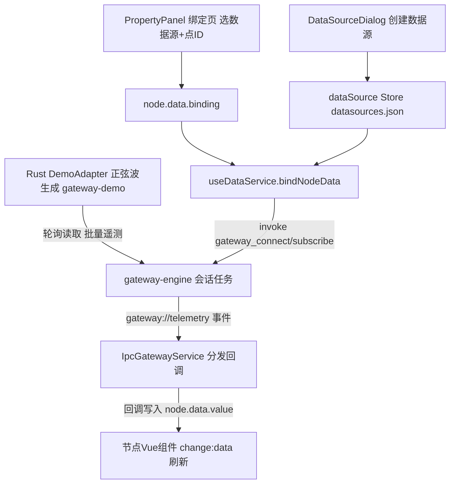

下面结合实例代码，从"内置模拟引擎 → 数据源注册 → 节点绑定 → 数据流动"完整讲一遍内置 WebSocket 数据源（演示模式）的流程。

> 注：Node 版内置模拟服务器（原 mock/server.ts）已移除，演示模式改由桌面端 Rust 网关内置 `DemoAdapter` 生成数据，经 Tauri IPC 推送，不占用任何端口。

## 整体链路




## ① 内置模拟引擎（桌面端 Rust，无端口）

[gateway-demo/src/lib.rs](file://C:/myf/project/allinone/roc-wes/src-tauri/crates/gateway-demo/src/lib.rs) 的 `DemoAdapter`（`profile = Websocket`）实现 `DeviceAdapter` 端口，由 gateway-engine 会话任务按轮询周期调用 `read()` 生成一批遥测：

```rust
// Rust 侧：按点位 ID 生成正弦波 + 确定性伪噪声（约 20~80）
fn ws_value(point_id: &str, now_ms: u64) -> f64 {
    let phase = (hash_u64(point_id) % 628) as f64 / 100.0;   // 0~2π，错开各点波形
    let noise = (pseudo_noise(point_id, now_ms) - 0.5) * 2.0; // ±1
    round1(50.0 + 30.0 * (now_ms as f64 / 5000.0 + phase).sin() + noise)
}
```

不同 pointId 的相位由哈希派生错开，多个仪表的曲线不会重叠；数据经 `gateway://telemetry` 事件批量推给前端（每轮询一次推一批，减少 IPC 开销）。


## ② 数据源注册（配置层）

用户在「数据源管理」对话框选 WebSocket 类型 + 演示模式时，地址自动预填为演示标识地址（[dataSource.ts](file://C:/myf/project/allinone/roc-wes/src/stores/dataSource.ts)）：

```ts
export const BUILTIN_MOCK_URLS: Record<DataSourceType, string> = {
    websocket: 'ws://localhost:8080/ws',   // 仅作演示模式标识，无对应本地服务
    // ...
}
```


保存后得到一个实例并落盘到 `datasources.json`：

```json
{ "id": "ds-1712345-abc123", "name": "车间遥测", "type": "websocket", "url": "ws://localhost:8080/ws" }
```


## ③ 节点绑定（PropertyPanel）

属性面板「数据绑定」页选择该数据源 + 填写点ID（如 `sensor.temp.001`）后，`updateBinding` 把配置写入节点并触发订阅：

```ts
// 必须同时具备点ID与数据源实例才启用绑定
if (pointId && bindingSourceId.value) {
  binding = { pointId, sourceId: bindingSourceId.value }
}
node.setData({ ...currentData, binding })   // 写 X6 节点
editorStore.updateNode(nodeId, { data: { ...(storeNode.data || {}), binding } })  // 写 Store 持久化
if (binding && props.canvasRef.bindNodeData) props.canvasRef.bindNodeData(node)   // 建立订阅
```


## ④ 服务调度（useDataService，总调度）

[useDataService.ts](file://C:/myf/project/allinone/roc-wes/src/composables/useDataService.ts) 是绑定逻辑的核心，`bindNodeData` 做三件事：

```ts
// 1. 按 sourceId 从 Store 解析出数据源实例
const ds = dataSourceStore.getDataSource(binding.sourceId)
sourceType = ds.type   // 'websocket'
sourceUrl = ds.url     // 'ws://localhost:8080/ws'

// 2. 按类型路由：演示模式（含 ws/http/sse/mqtt）与工业协议统一走 IPC
if (isDemoSource(sourceType, sourceUrl, sourceConfig) || INDUSTRIAL_TYPES.has(sourceType)) {
  // 演示模式映射为 { kind:'demo', profile:'websocket', pollIntervalMs }
  service = new IpcGatewayService(key, buildDeviceConfig(sourceType, sourceUrl, sourceConfig), 'WEBSOCKET')
}

// 3. 订阅点ID，回调里把值写入节点
service.subscribe(binding.pointId, (point) => {
  const newValue = transform ? transform(point.value) : point.value  // 可选转换函数
  const nextData = { ...currentData, value: newValue, _timestamp: point.timestamp, _quality: point.quality }
  node.setData(nextData)
  evaluateNodeEvents(node.id, currentData, nextData)  // 触发事件规则（如越限告警）
})
```


**关键设计**：10 个节点绑同一个数据源，只会创建 **1 个** IPC 会话（`dataServiceMap` 按 `类型:URL:配置` 缓存），各自订阅不同的 pointId。

## ⑤ 连接与订阅分发（IpcGatewayService → Rust）

[IpcGatewayService.ts](file://C:/myf/project/allinone/roc-wes/src/services/IpcGatewayService.ts) 实现与 WebSocketService 相同的 `IDataService` 接口，底层换成 Tauri IPC：

```ts
// 建会话：请求 Rust 创建演示适配器并启动轮询任务
await invoke('gateway_connect', { deviceId, config: { kind: 'demo', profile: 'websocket', pollIntervalMs: 1000 } })

// 订阅：登记回调 + 通知 Rust（连接建立前的订阅会补发）
await invoke('gateway_subscribe', { deviceId, pointId })

// 接收遥测：批量事件按 pointId 分发给该点的所有回调
listen('gateway://telemetry', (e) => {
  for (const p of e.payload.points) { /* 分发给 callbacks.get(p.pointId) */ }
})
```


## ⑥ 数据到达节点 UI

`node.setData()` 触发 X6 的 `change:data` 事件，节点 Vue 组件通过 [useNodeData.ts](file://C:/myf/project/allinone/roc-wes/src/composables/useNodeData.ts) 声明的响应式 ref 自动刷新：

```ts
const { value } = useNodeData(props.node, { value: 0 })  // 模板里 {{ value }} 实时跳动
```


## ⑦ 生命周期清理

- 改绑定点ID：`unbindNodeData(nodeId)` 先取消旧订阅再重建
- 画布重载：`unbindAllNodes()` 只退订**不断会话**（会话可复用）
- 组件卸载：`dispose()` 退订 + `disconnect()` 销毁全部 IPC 会话（应用退出时 Rust 侧也会统一 shutdown）

## 一个完整例子

给仪表节点绑定 `sensor.temp.001`：
1. 数据源管理新建 WebSocket 演示数据源 → 预填 `ws://localhost:8080/ws`（仅标识）
2. 属性面板选该数据源、点ID 填 `sensor.temp.001`
3. 前端 `invoke('gateway_subscribe', { pointId: 'sensor.temp.001' })`
4. Rust 会话每秒调 `DemoAdapter.read()`，经 `gateway://telemetry` 推回 `{pointId:'sensor.temp.001', value:63.4, ...}`
5. 回调写入 `node.data.value = 63.4` → 仪表盘指针每秒跳动一次
6. 若配置了转换函数 `(raw) => Math.round(raw)`，显示前会先取整；若事件规则设了 `value > 75 告警`，正弦波升过 75 时触发上升沿告警

切换到真实设备时，把数据源改为真实模式并填入真实 WS 服务地址（消息格式兼容 `topic/id/pointId` 任一字段标识点位即可），前端代码零改动。
