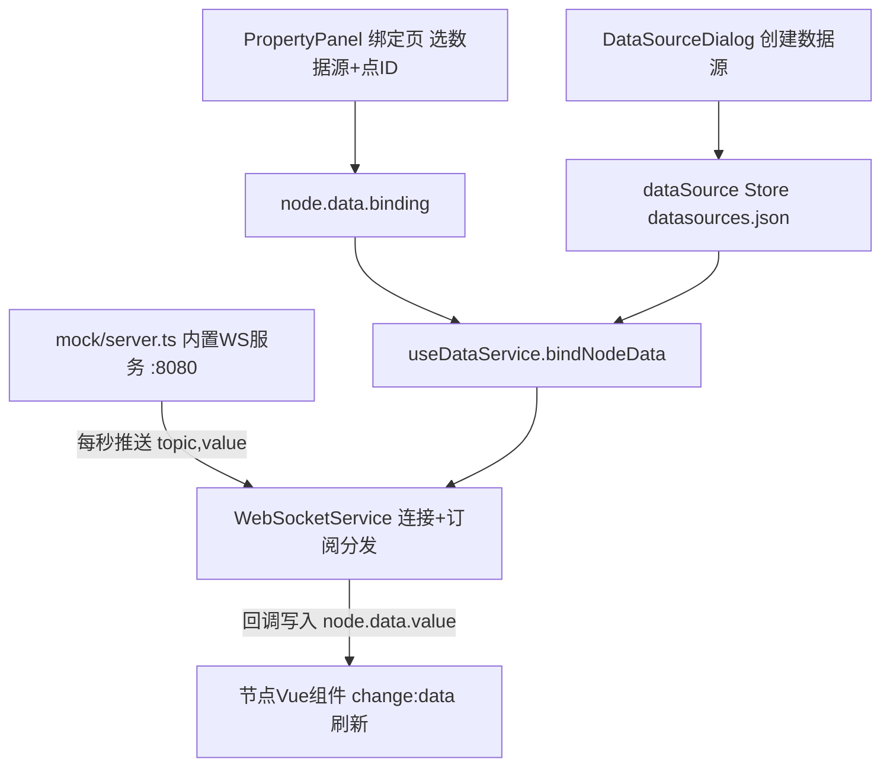

下面结合实例代码，从"模拟服务端 → 数据源注册 → 节点绑定 → 数据流动"完整讲一遍内置 WebSocket 数据源的流程。

## 整体链路




## ① 内置模拟服务端（dev 环境自动启动）

[mock/server.ts](file://C:/myf/project/allinone/roc-wes/mock/server.ts) 由 vite dev 插件拉起，WebSocket 服务跑在 `ws://localhost:8080/ws`，采用**订阅制协议**：前端发订阅指令，服务端按 1 秒周期向已订阅的点推数据：

```ts
// 前端 → 服务端：登记数据点
if (msg.action === 'subscribe' && msg.topic) points.add(msg.topic)

// 服务端 → 前端：周期推送（setInterval 1000ms）
ws.send(JSON.stringify({ topic: pointId, value: gen(pointId, t), timestamp: t, quality: 'good' }))
```


模拟值由 [generators.ts](file://C:/myf/project/allinone/roc-wes/mock/generators.ts) 的 `wsValue` 生成——**20~80 的正弦波 + 微噪声**，不同 pointId 相位错开（哈希偏移），所以多个仪表的曲线不会重叠：

```ts
export function wsValue(pointId: string, t: number): number {
  const phase = hashPhase(pointId)
  return round1(50 + 30 * Math.sin(t / 5000 + phase) + (Math.random() - 0.5) * 2)
}
```


## ② 数据源注册（配置层）

用户在「数据源管理」对话框选 WebSocket 类型 + 演示模式时，地址自动预填为内置地址（[dataSource.ts](file://C:/myf/project/allinone/roc-wes/src/stores/dataSource.ts)）：

```ts
export const BUILTIN_MOCK_URLS: Record<DataSourceType, string> = {
    websocket: 'ws://localhost:8080/ws',
    // ...
}
```


保存后得到一个实例并落盘到 `datasources.json`：

```json
{ "id": "ds-1712345-abc123", "name": "车间遥测", "type": "websocket", "url": "ws://localhost:8080/ws" }
```


## ③ 节点绑定（PropertyPanel）

属性面板「数据绑定」页选择该数据源 + 填写点ID（如 `sensor.temp.001`）后，`updateBinding` 把配置写入节点并触发订阅：

```ts
// 必须同时具备点ID与数据源实例才启用绑定
if (pointId && bindingSourceId.value) {
  binding = { pointId, sourceId: bindingSourceId.value }
}
node.setData({ ...currentData, binding })   // 写 X6 节点
editorStore.updateNode(nodeId, { data: { ...(storeNode.data || {}), binding } })  // 写 Store 持久化
if (binding && props.canvasRef.bindNodeData) props.canvasRef.bindNodeData(node)   // 建立订阅
```


## ④ 服务调度（useDataService，总调度）

[useDataService.ts](file://C:/myf/project/allinone/roc-wes/src/composables/useDataService.ts) 是绑定逻辑的核心，`bindNodeData` 做三件事：

```ts
// 1. 按 sourceId 从 Store 解析出数据源实例
const ds = dataSourceStore.getDataSource(binding.sourceId)
sourceType = ds.type   // 'websocket'
sourceUrl = ds.url     // 'ws://localhost:8080/ws'

// 2. 按类型路由到服务（同数据源只建一条连接，按 key 缓存）
case 'websocket':
  service = new WebSocketService(sourceUrl)

// 3. 订阅点ID，回调里把值写入节点
service.subscribe(binding.pointId, (point) => {
  const newValue = transform ? transform(point.value) : point.value  // 可选转换函数
  const nextData = { ...currentData, value: newValue, _timestamp: point.timestamp, _quality: point.quality }
  node.setData(nextData)
  evaluateNodeEvents(node.id, currentData, nextData)  // 触发事件规则（如越限告警）
})
```


**关键设计**：10 个节点绑同一个数据源，只会创建 **1 条** WebSocket 连接（`dataServiceMap` 按 `类型:URL:配置` 缓存），各自订阅不同的 pointId。

## ⑤ 连接与订阅分发（WebSocketService）

[WebSocketService.ts](file://C:/myf/project/allinone/roc-wes/src/services/WebSocketService.ts) 实现 `IDataService` 接口：

```ts
// 订阅：本地登记回调 + 通知服务端
subscribe(pointId, callback) {
  this.callbacks.get(pointId)!.push(callback)
  this.ws.send(JSON.stringify({ action: 'subscribe', topic: pointId }))
}

// 收到推送：按 topic 分发给该点的所有回调
const pointId = data.topic || data.id || data.pointId   // 兼容多种消息格式
for (const cb of this.callbacks.get(pointId) || []) cb(point)

// 断线 3 秒自动重连，重连成功后自动重新订阅所有主题
this.ws.onopen = () => {
  for (const [topic] of this.callbacks) this.sendSubscribe(topic)
}
```


## ⑥ 数据到达节点 UI

`node.setData()` 触发 X6 的 `change:data` 事件，节点 Vue 组件通过 [useNodeData.ts](file://C:/myf/project/allinone/roc-wes/src/composables/useNodeData.ts) 声明的响应式 ref 自动刷新：

```ts
const { value } = useNodeData(props.node, { value: 0 })  // 模板里 {{ value }} 实时跳动
```


## ⑦ 生命周期清理

- 改绑定点ID：`unbindNodeData(nodeId)` 先取消旧订阅再重建
- 画布重载：`unbindAllNodes()` 只退订**不断连接**（连接可复用）
- 组件卸载：`dispose()` 退订 + `disconnect()` 关闭全部连接

## 一个完整例子

给仪表节点绑定 `sensor.temp.001`：
1. 数据源管理新建 WebSocket 演示数据源 → `ws://localhost:8080/ws`
2. 属性面板选该数据源、点ID 填 `sensor.temp.001`
3. 前端发 `{"action":"subscribe","topic":"sensor.temp.001"}`
4. mock 服务每秒推 `{"topic":"sensor.temp.001","value":63.4,...}`
5. 回调写入 `node.data.value = 63.4` → 仪表盘指针每秒跳动一次
6. 若配置了转换函数 `(raw) => Math.round(raw)`，显示前会先取整；若事件规则设了 `value > 75 告警`，正弦波升过 75 时触发上升沿告警

切换到真实设备时，只需把数据源地址改成真实 WS 服务（消息格式兼容 `topic/id/pointId` 任一字段标识点位即可），前端代码零改动。