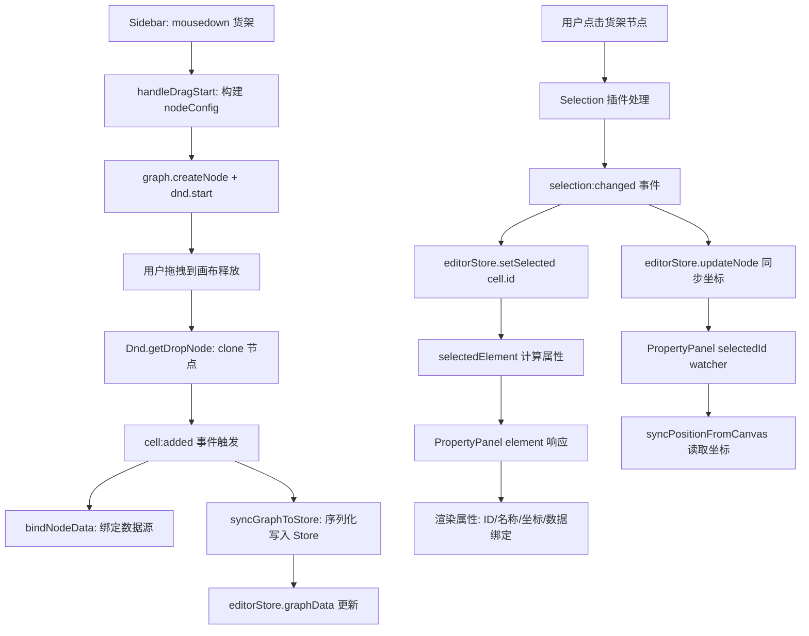

## 完整流程分析

### 阶段一：初始化阶段（页面加载时）

```
main.ts → register({ shape: 'rack-node', component: RackNode })
```

将 `RackNode.vue` 注册为 X6 的自定义 Vue Shape，之后 X6 渲染 `shape: 'rack-node'` 的节点时，自动使用 `RackNode.vue` 渲染。

`X6Canvas.vue` 的 `onMounted` 中：
- 创建 `Graph` 实例（画布）
- 初始化 `Selection`、`Dnd`、`Clipboard`、`Keyboard` 插件
- 通过 `emit('ready', { graph, dnd })` 通知父组件

`MainLayout.vue` 收到 `ready` 事件后：
```js
const onCanvasReady = (payload) => {
  graphInstance.value = payload.graph
  dndInstance.value = payload.dnd
}
```

此时 `Sidebar` 才渲染（`v-if="graphInstance && dndInstance"`），并接收到 `graph` 和 `dnd` 实例。

---

### 阶段二：从 Sidebar 拖拽货架节点

**步骤 2.1：鼠标按下，触发 `handleDragStart`**

```
Sidebar.vue → @mousedown="handleDragStart($event, item)"
```

其中 `item` 为：
```js
{ type: 'rack-node', label: '货架', icon: '🏛️', pointIdTemplate: 'device.rack' }
```


**步骤 2.2：构建节点配置 `nodeConfig`**

进入 `else if (item.type === 'rack-node')` 分支：
```js
const generator = PointIdGenerator.getInstance()
generator.initFromNodes(props.graph.getNodes())
const pointId = generator.generate('device.rack')  // 生成唯一数据点ID

nodeConfig.data = {
  name: '货架-A01',
  rows: 4, cols: 6,
  grid: [...],           // 随机货位占用状态
  pointId,
  binding: { pointId, sourceType: 'websocket', transform: ... }
}
nodeConfig.width = 200
nodeConfig.height = 150
```


**步骤 2.3：创建 X6 节点并启动 Dnd**

```js
const node = props.graph.createNode(nodeConfig)  // shape: 'rack-node'
props.dnd.start(node, e)  // 启动拖拽
```


**步骤 2.4：拖拽到画布并释放（drop）**

`Dnd` 插件的 `getDropNode` 回调克隆节点放入画布：
```js
getDropNode: (node) => node.clone()
```


**步骤 2.5：`cell:added` 事件触发**

节点被添加到画布后，`X6Canvas.vue` 中的监听器触发：
```js
graph.on('cell:added', ({cell}) => {
  if (cell.isNode()) {
    const data = cell.getData()
    if (data?.binding?.pointId) {
      bindNodeData(cell)    // 绑定数据源（MockDataService/WebSocket）
    }
    applyNodeAnimation(cell) // 应用动画（如果有）
  }
  syncGraphToStore()         // 同步到 Store
  editorStore.pushHistory()  // 记录历史
})
```


`syncGraphToStore()` 将画布 JSON 序列化后写入 store：
```js
function syncGraphToStore() {
  const data = graph.toJSON()
  const nodes = data.cells
    .filter(cell => !('source' in cell && 'target' in cell))
    .map(node => ({ ...node, x: node.position?.x ?? 0, y: node.position?.y ?? 0 }))
  const edges = data.cells.filter(cell => 'source' in cell && 'target' in cell)
  editorStore.setGraphData({ nodes, edges })
}
```


---

### 阶段三：点击节点，选中触发属性面板

**步骤 3.1：用户点击画布中的货架节点**

X6 的 `Selection` 插件处理点击事件，触发 `selection:changed`：

```js
graph.on('selection:changed', ({selected}) => {
  if (selected && selected.length > 0) {
    const cell = selected[0]
    editorStore.setSelected(cell.id)  // ① 设置选中 ID

    if (cell.isNode()) {
      const pos = cell.getPosition()
      editorStore.updateNode(cell.id, { x: pos.x, y: pos.y })  // ② 同步坐标到 store
    }
  } else {
    editorStore.setSelected(null)
  }
})
```


**步骤 3.2：Store 中 `selectedId` 更新**

```js
function setSelected(id: string | null) {
  selectedId.value = id
}
```


**步骤 3.3：`selectedElement` 计算属性重新计算**

```js
const selectedElement = computed(() => {
  if (!selectedId.value) return null
  const node = graphData.value.nodes.find(n => n.id === selectedId.value)
  if (node) return { type: 'node', data: node }
  // ...
})
```

此时返回的是 store 中保存的节点数据（包含 `name`、`rows`、`cols`、`grid`、`pointId`、`binding` 等）。

---

### 阶段四：PropertyPanel 显示属性

**步骤 4.1：`element` 计算属性响应**

```js
const element = computed(() => editorStore.selectedElement)
```


**步骤 4.2：模板渲染**

由于 `element.type === 'node'`，渲染节点属性区域：

| 显示字段 | 数据来源 | 条件 |
|---------|---------|------|
| ID | `element.data.id` | 始终显示 |
| 类型 | `element.type === 'node'` → "节点" | 始终显示 |
| 标签 | `element.data.label` | 始终显示 |
| **名称** | `element.data.name` | `element.data.name !== undefined` 时显示（货架节点有 `name: '货架-A01'`）|
| X / Y 坐标 | `posX` / `posY`（独立 ref） | 始终显示 |
| 数据绑定配置 | `binding` 相关字段 | 折叠面板 |

**步骤 4.3：坐标同步（`selectedId` watcher 触发）**

```js
watch(() => editorStore.selectedId, (newId) => {
  if (newId && newId !== lastSyncedNodeId) {
    lastSyncedNodeId = newId
    syncPositionFromCanvas()   // 从 X6 节点实例读取真实坐标
    startPositionPolling()     // 启动 rAF 轮询持续同步位置
  }
})
```


`syncPositionFromCanvas()` 直接从 X6 节点获取精确坐标：
```js
function syncPositionFromCanvas() {
  const cell = graph.getCellById(editorStore.selectedId)
  if (cell && cell.isNode()) {
    const pos = cell.getPosition()
    posX.value = Math.round(pos.x)
    posY.value = Math.round(pos.y)
  }
}
```


**步骤 4.4：数据绑定配置加载（`element` watcher 触发）**

```js
watch(() => element.value, (newElement) => {
  if (newElement && newElement.type === 'node') {
    const data = newElement.data
    let binding = data?.binding || {}
    // 如果 store 中没有 binding，尝试从 X6 节点实例直接读取
    if (!binding.pointId) {
      const node = graph.getCellById(newElement.data.id)
      if (node && node.isNode()) {
        const nodeData = node.getData()
        if (nodeData?.binding?.pointId) binding = nodeData.binding
      }
    }
    bindingSourceType.value = binding.sourceType || 'websocket'
    bindingPointId.value = binding.pointId || ''
    // ...
  }
})
```


---

## 数据流总结图




---

## 关键设计要点

1. **Store 是单一数据源**：所有属性面板的数据来自 `editorStore.selectedElement`，而非直接读取 X6 节点。
2. **双向同步**：PropertyPanel 修改属性 → 调用 `updateNodeName()` 写入 X6 节点 → X6 `cell:change:data` → `syncGraphToStore()` → Store 更新。
3. **坐标独立管理**：位置通过 `posX/posY` ref + rAF 轮询从 X6 实例直接读取，避免 deep watcher 导致的响应式循环。
4. **数据绑定兜底**：如果 store 中 `binding` 数据不完整，PropertyPanel 会直接从 X6 节点实例读取，确保信息不丢失。